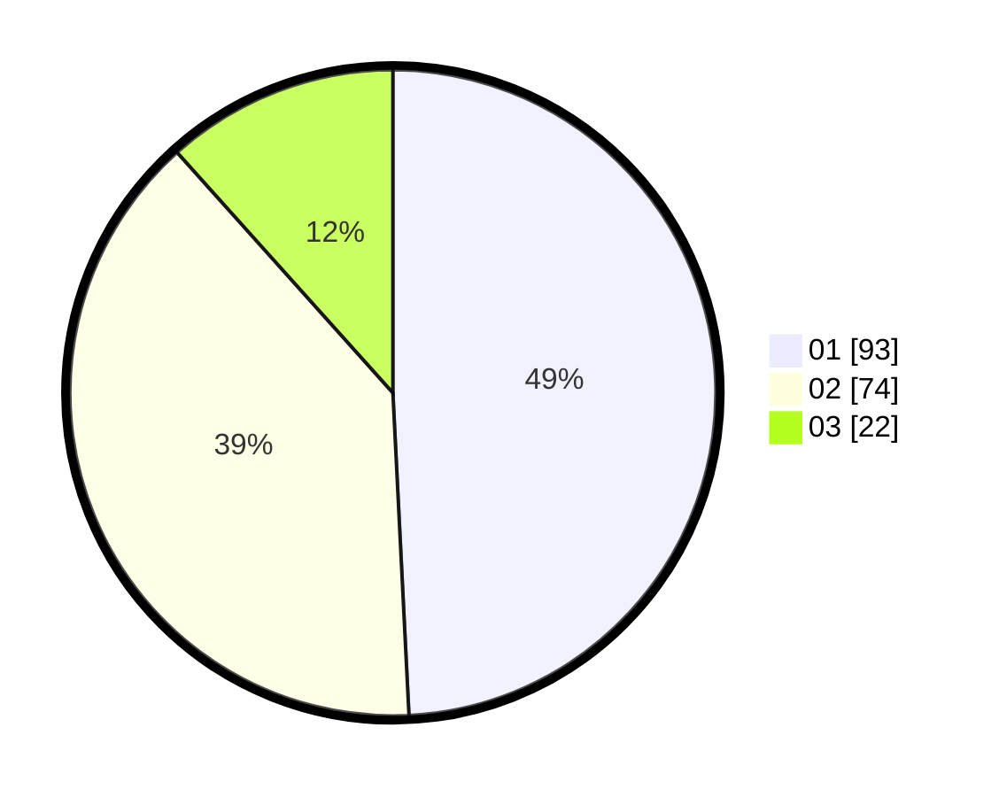

# Hasil

Hasil perolehan suara paslon dapat dilihat pada file paslon-01.txt, paslon-02.txt, dan paslon-03.txt.

Jika tidak ada, artinya data tersebut belum ada pada SIREKAP.

## Perolehan Suara

 * Paslon 01: **93**.
 * Paslon 02: **74**.
 * Paslon 03: **22**.

## Foto C Plano

https://sirekap-obj-formc.kpu.go.id/152e/pemilu/ppwp/31/71/04/10/04/3171041004025-20240216-003521--f973ead4-86cc-4f23-a7eb-a1f6204aa7a9.jpg

https://sirekap-obj-formc.kpu.go.id/152e/pemilu/ppwp/31/71/04/10/04/3171041004025-20240216-003528--05e9bcf5-1d1a-402a-8beb-ec06b74d557d.jpg

https://sirekap-obj-formc.kpu.go.id/152e/pemilu/ppwp/31/71/04/10/04/3171041004025-20240216-003524--cca136a6-98ef-48c8-b0d8-72e92b8e2b51.jpg

## DATA PEMILIH TETAP

Jumlah pemilih dalam DPT: **275**.
 * L: **145**.
 * P: **130**.

## DATA PENGGUNA HAK PILIH

Jumlah pengguna hak pilih dalam DPT: **188**.
 * L: **96**.
 * P: **92**.

Jumlah pengguna hak pilih dalam DPTb: **0**.
 * L: **0**.
 * P: **0**.

Jumlah pengguna hak pilih dalam DPK: **1**.
 * L: **0**.
 * P: **1**.

Jumlah pengguna hak pilih: **189**.
 * L: **96**.
 * P: **93**.

## JUMLAH SUARA SAH DAN TIDAK SAH

JUMLAH SELURUH SUARA SAH: **189**.

JUMLAH SUARA TIDAK SAH: **0**.

JUMLAH SELURUH SUARA SAH DAN SUARA TIDAK SAH: **189**.
