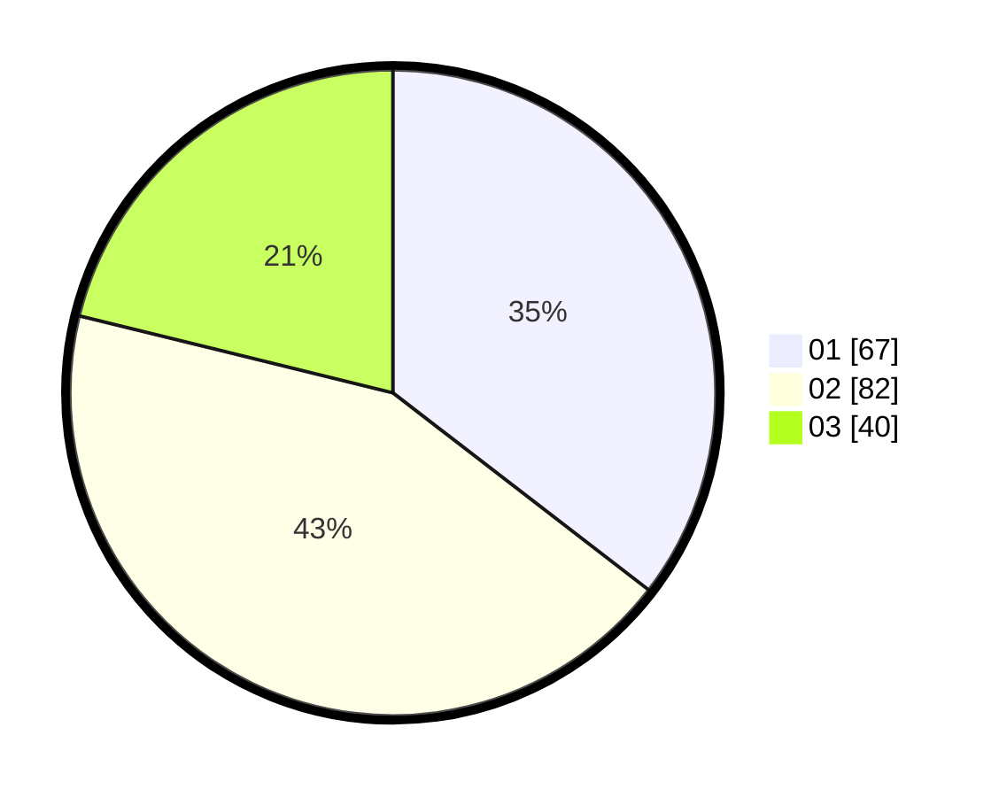

# Hasil

Hasil perolehan suara paslon dapat dilihat pada file paslon-01.txt, paslon-02.txt, dan paslon-03.txt.

Jika tidak ada, artinya data tersebut belum ada pada SIREKAP.

## Perolehan Suara

 * Paslon 01: **67**.
 * Paslon 02: **82**.
 * Paslon 03: **40**.

## Foto C Plano

https://sirekap-obj-formc.kpu.go.id/684c/pemilu/ppwp/31/71/04/10/04/3171041004029-20240214-155851--4fd49e54-8db9-4451-8644-47362ae52d0e.jpg

https://sirekap-obj-formc.kpu.go.id/684c/pemilu/ppwp/31/71/04/10/04/3171041004029-20240214-160101--ea343702-2377-4690-95fb-b59fb6d304c9.jpg

https://sirekap-obj-formc.kpu.go.id/684c/pemilu/ppwp/31/71/04/10/04/3171041004029-20240214-160139--2d968578-d718-48ae-a568-e2f9138a5cad.jpg

## DATA PEMILIH TETAP

Jumlah pemilih dalam DPT: **273**.
 * L: **140**.
 * P: **139**.

## DATA PENGGUNA HAK PILIH

Jumlah pengguna hak pilih dalam DPT: **190**.
 * L: **94**.
 * P: **96**.

Jumlah pengguna hak pilih dalam DPTb: **1**.
 * L: **1**.
 * P: **0**.

Jumlah pengguna hak pilih dalam DPK: **0**.
 * L: **0**.
 * P: **0**.

Jumlah pengguna hak pilih: **191**.
 * L: **95**.
 * P: **96**.

## JUMLAH SUARA SAH DAN TIDAK SAH

JUMLAH SELURUH SUARA SAH: **189**.

JUMLAH SUARA TIDAK SAH: **2**.

JUMLAH SELURUH SUARA SAH DAN SUARA TIDAK SAH: **191**.
