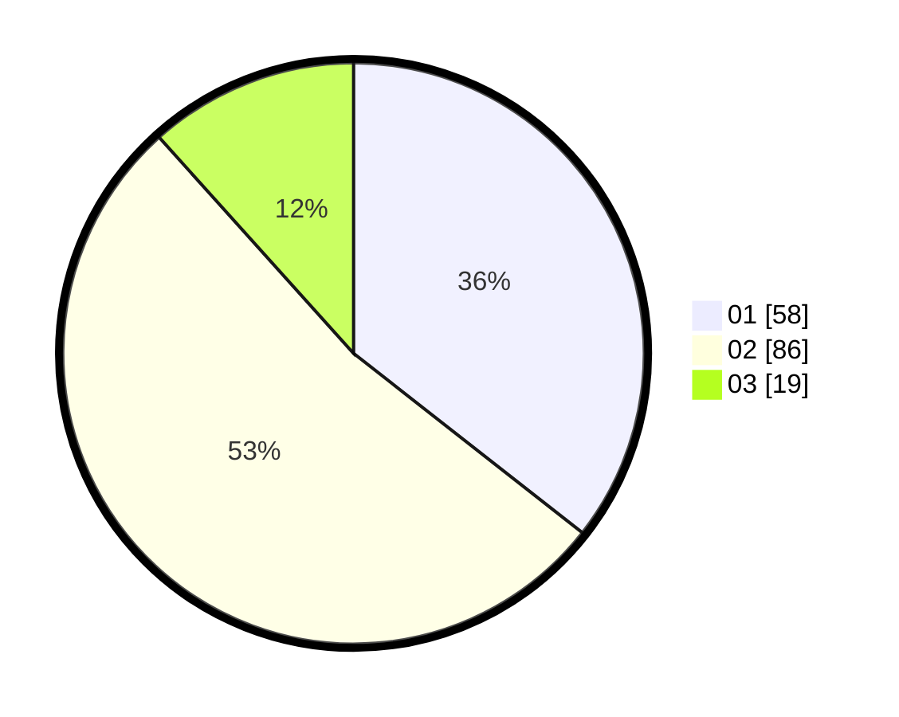

# Hasil

Hasil perolehan suara paslon dapat dilihat pada file paslon-01.txt, paslon-02.txt, dan paslon-03.txt.

Jika tidak ada, artinya data tersebut belum ada pada SIREKAP.

## Perolehan Suara

 * Paslon 01: **58**.
 * Paslon 02: **86**.
 * Paslon 03: **19**.

## Foto C Plano

https://sirekap-obj-formc.kpu.go.id/785a/pemilu/ppwp/31/71/04/10/04/3171041004031-20240218-165646--1d7e7a93-7321-45cf-9299-e88fd53a9a5a.jpg

https://sirekap-obj-formc.kpu.go.id/785a/pemilu/ppwp/31/71/04/10/04/3171041004031-20240218-165721--d237c4e4-c556-4440-8a3b-4e284a79ac7e.jpg

https://sirekap-obj-formc.kpu.go.id/785a/pemilu/ppwp/31/71/04/10/04/3171041004031-20240218-165833--89c62771-f123-488b-bbb2-cedb1e0a8990.jpg

## DATA PEMILIH TETAP

Jumlah pemilih dalam DPT: **279**.
 * L: **136**.
 * P: **143**.

## DATA PENGGUNA HAK PILIH

Jumlah pengguna hak pilih dalam DPT: **161**.
 * L: **78**.
 * P: **83**.

Jumlah pengguna hak pilih dalam DPTb: **0**.
 * L: **0**.
 * P: **0**.

Jumlah pengguna hak pilih dalam DPK: **3**.
 * L: **1**.
 * P: **2**.

Jumlah pengguna hak pilih: **164**.
 * L: **79**.
 * P: **85**.

## JUMLAH SUARA SAH DAN TIDAK SAH

JUMLAH SELURUH SUARA SAH: **163**.

JUMLAH SUARA TIDAK SAH: **1**.

JUMLAH SELURUH SUARA SAH DAN SUARA TIDAK SAH: **164**.
