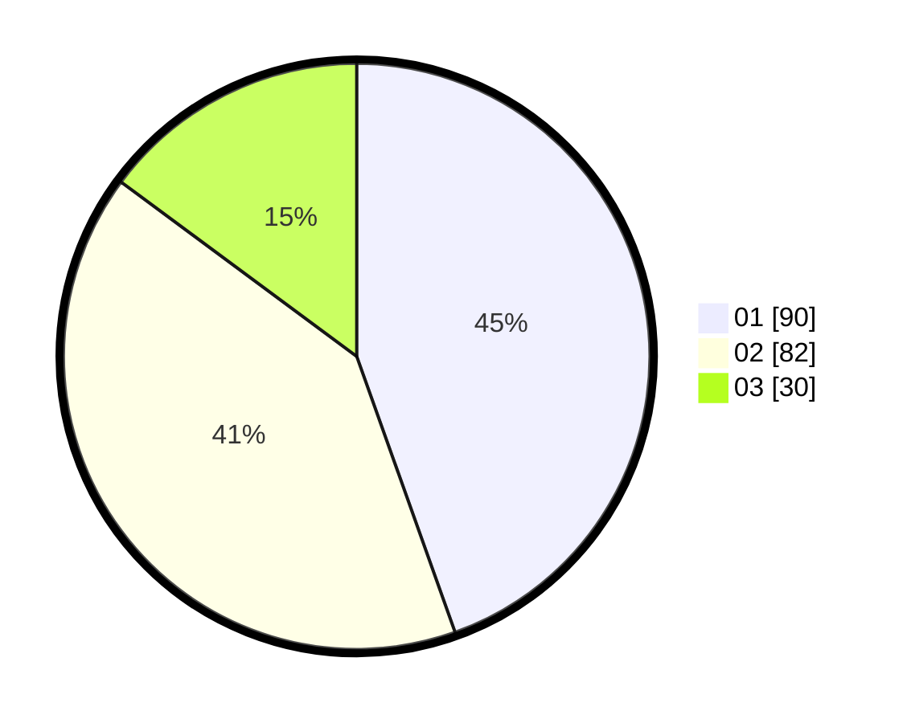

# Hasil

Hasil perolehan suara paslon dapat dilihat pada file paslon-01.txt, paslon-02.txt, dan paslon-03.txt.

Jika tidak ada, artinya data tersebut belum ada pada SIREKAP.

## Perolehan Suara

 * Paslon 01: **90**.
 * Paslon 02: **82**.
 * Paslon 03: **30**.

## Foto C Plano

https://sirekap-obj-formc.kpu.go.id/c1b7/pemilu/ppwp/31/71/04/10/04/3171041004032-20240218-145139--92cf5d7b-b9e9-44a8-b057-321dd2b8854b.jpg

https://sirekap-obj-formc.kpu.go.id/c1b7/pemilu/ppwp/31/71/04/10/04/3171041004032-20240218-151513--6215face-ec12-4fa2-aa30-a533d55de02d.jpg

https://sirekap-obj-formc.kpu.go.id/c1b7/pemilu/ppwp/31/71/04/10/04/3171041004032-20240218-151758--26123586-ecea-4f7f-914c-171ae4ebe62a.jpg

## DATA PEMILIH TETAP

Jumlah pemilih dalam DPT: **277**.
 * L: **143**.
 * P: **134**.

## DATA PENGGUNA HAK PILIH

Jumlah pengguna hak pilih dalam DPT: **206**.
 * L: **102**.
 * P: **104**.

Jumlah pengguna hak pilih dalam DPTb: **0**.
 * L: **0**.
 * P: **0**.

Jumlah pengguna hak pilih dalam DPK: **0**.
 * L: **0**.
 * P: **0**.

Jumlah pengguna hak pilih: **206**.
 * L: **102**.
 * P: **104**.

## JUMLAH SUARA SAH DAN TIDAK SAH

JUMLAH SELURUH SUARA SAH: **202**.

JUMLAH SUARA TIDAK SAH: **4**.

JUMLAH SELURUH SUARA SAH DAN SUARA TIDAK SAH: **206**.
