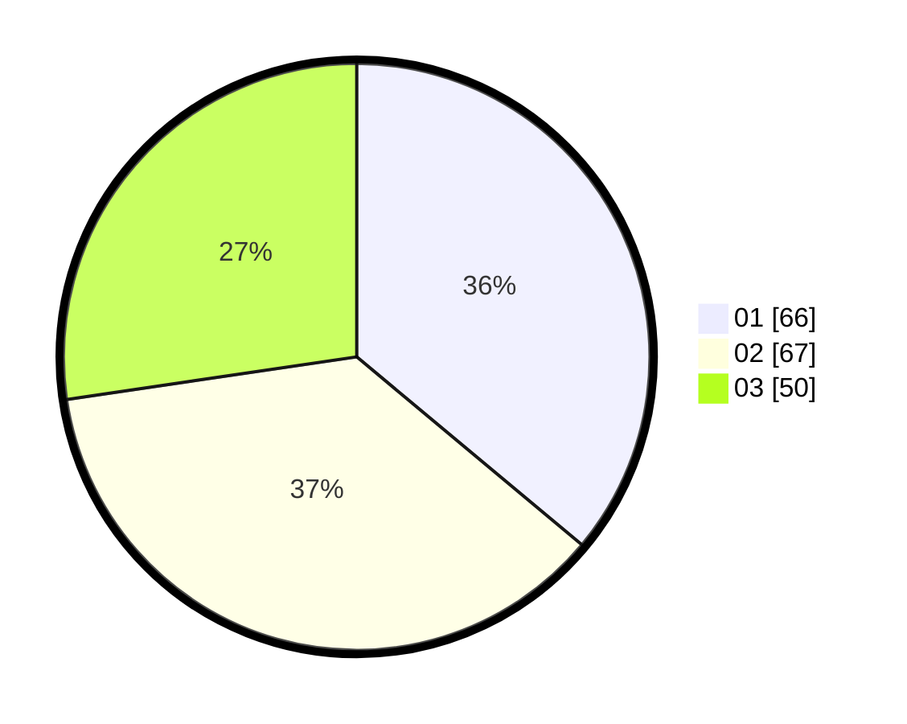

# Hasil

Hasil perolehan suara paslon dapat dilihat pada file paslon-01.txt, paslon-02.txt, dan paslon-03.txt.

Jika tidak ada, artinya data tersebut belum ada pada SIREKAP.

## Perolehan Suara

 * Paslon 01: **66**.
 * Paslon 02: **67**.
 * Paslon 03: **50**.

## Foto C Plano

https://sirekap-obj-formc.kpu.go.id/8615/pemilu/ppwp/31/71/04/10/04/3171041004049-20240214-191544--91fa178e-4c62-4abf-8081-bf0393bea7a2.jpg

https://sirekap-obj-formc.kpu.go.id/8615/pemilu/ppwp/31/71/04/10/04/3171041004049-20240214-191714--71af8dff-9122-4b0b-bca7-2cb1570daf4d.jpg

https://sirekap-obj-formc.kpu.go.id/8615/pemilu/ppwp/31/71/04/10/04/3171041004049-20240214-191313--1dd2bb7c-cd9d-40c9-b598-6ea780144c14.jpg

## DATA PEMILIH TETAP

Jumlah pemilih dalam DPT: **262**.
 * L: **123**.
 * P: **139**.

## DATA PENGGUNA HAK PILIH

Jumlah pengguna hak pilih dalam DPT: **170**.
 * L: **77**.
 * P: **93**.

Jumlah pengguna hak pilih dalam DPTb: **15**.
 * L: **0**.
 * P: **15**.

Jumlah pengguna hak pilih dalam DPK: **5**.
 * L: **2**.
 * P: **3**.

Jumlah pengguna hak pilih: **190**.
 * L: **79**.
 * P: **111**.

## JUMLAH SUARA SAH DAN TIDAK SAH

JUMLAH SELURUH SUARA SAH: **183**.

JUMLAH SUARA TIDAK SAH: **7**.

JUMLAH SELURUH SUARA SAH DAN SUARA TIDAK SAH: **190**.
