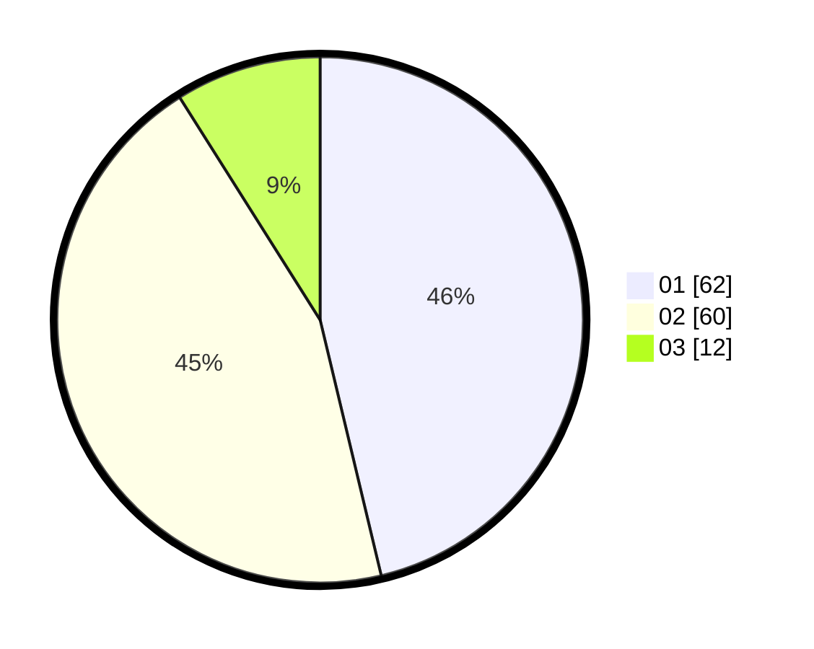

# Hasil

Hasil perolehan suara paslon dapat dilihat pada file paslon-01.txt, paslon-02.txt, dan paslon-03.txt.

Jika tidak ada, artinya data tersebut belum ada pada SIREKAP.

## Perolehan Suara

 * Paslon 01: **62**.
 * Paslon 02: **60**.
 * Paslon 03: **12**.

## Foto C Plano

https://sirekap-obj-formc.kpu.go.id/b51f/pemilu/ppwp/31/71/04/10/04/3171041004061-20240215-171736--b113aa45-0d80-41ba-9308-919c32db7e0f.jpg

https://sirekap-obj-formc.kpu.go.id/b51f/pemilu/ppwp/31/71/04/10/04/3171041004061-20240215-171759--8184560f-a548-4d2a-8411-5bf10fef1220.jpg

https://sirekap-obj-formc.kpu.go.id/b51f/pemilu/ppwp/31/71/04/10/04/3171041004061-20240215-171748--e1bd3d26-2a18-49d1-be96-048c49af8ba8.jpg

## DATA PEMILIH TETAP

Jumlah pemilih dalam DPT: **197**.
 * L: **97**.
 * P: **100**.

## DATA PENGGUNA HAK PILIH

Jumlah pengguna hak pilih dalam DPT: **136**.
 * L: **67**.
 * P: **69**.

Jumlah pengguna hak pilih dalam DPTb: **2**.
 * L: **1**.
 * P: **1**.

Jumlah pengguna hak pilih dalam DPK: **0**.
 * L: **0**.
 * P: **0**.

Jumlah pengguna hak pilih: **138**.
 * L: **68**.
 * P: **70**.

## JUMLAH SUARA SAH DAN TIDAK SAH

JUMLAH SELURUH SUARA SAH: **134**.

JUMLAH SUARA TIDAK SAH: **4**.

JUMLAH SELURUH SUARA SAH DAN SUARA TIDAK SAH: **138**.
