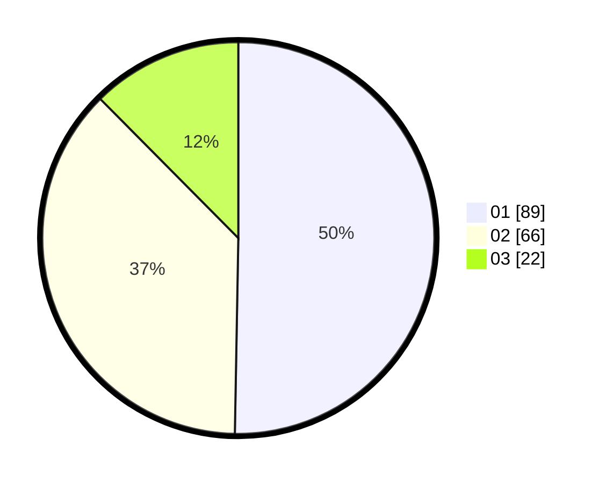

# Hasil

Hasil perolehan suara paslon dapat dilihat pada file paslon-01.txt, paslon-02.txt, dan paslon-03.txt.

Jika tidak ada, artinya data tersebut belum ada pada SIREKAP.

## Perolehan Suara

 * Paslon 01: **89**.
 * Paslon 02: **66**.
 * Paslon 03: **22**.

## Foto C Plano

https://sirekap-obj-formc.kpu.go.id/4685/pemilu/ppwp/31/71/04/10/04/3171041004063-20240216-175753--75d4b08f-11da-4934-bdd3-8b84f5891cd3.jpg

https://sirekap-obj-formc.kpu.go.id/4685/pemilu/ppwp/31/71/04/10/04/3171041004063-20240216-175754--b0989027-cdcb-4427-93e0-15f5e4572b70.jpg

https://sirekap-obj-formc.kpu.go.id/4685/pemilu/ppwp/31/71/04/10/04/3171041004063-20240216-175754--4c2b7480-5cef-476b-b465-badc6a7f2800.jpg

## DATA PEMILIH TETAP

Jumlah pemilih dalam DPT: **0**.
 * L: **0**.
 * P: **0**.

## DATA PENGGUNA HAK PILIH

Jumlah pengguna hak pilih dalam DPT: **0**.
 * L: **0**.
 * P: **0**.

Jumlah pengguna hak pilih dalam DPTb: **0**.
 * L: **0**.
 * P: **0**.

Jumlah pengguna hak pilih dalam DPK: **0**.
 * L: **0**.
 * P: **0**.

Jumlah pengguna hak pilih: **0**.
 * L: **0**.
 * P: **0**.

## JUMLAH SUARA SAH DAN TIDAK SAH

JUMLAH SELURUH SUARA SAH: **177**.

JUMLAH SUARA TIDAK SAH: **4**.

JUMLAH SELURUH SUARA SAH DAN SUARA TIDAK SAH: **181**.
