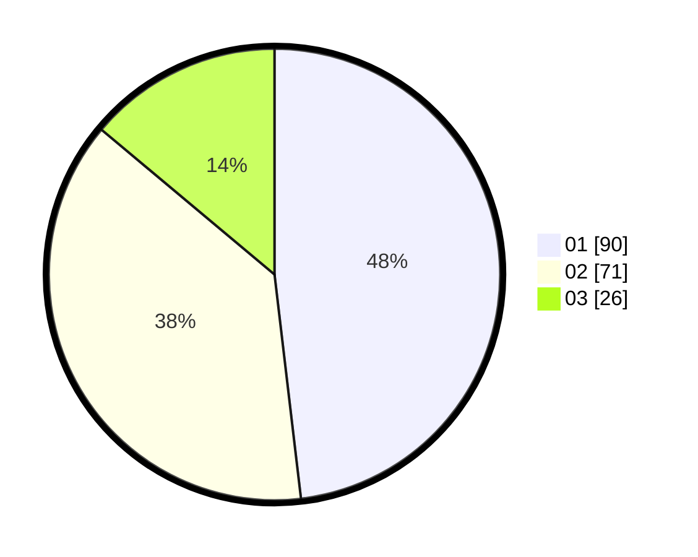

# Hasil

Hasil perolehan suara paslon dapat dilihat pada file paslon-01.txt, paslon-02.txt, dan paslon-03.txt.

Jika tidak ada, artinya data tersebut belum ada pada SIREKAP.

## Perolehan Suara

 * Paslon 01: **90**.
 * Paslon 02: **71**.
 * Paslon 03: **26**.

## Foto C Plano

https://sirekap-obj-formc.kpu.go.id/4e8b/pemilu/ppwp/31/71/04/10/04/3171041004072-20240216-003326--752b67b6-e499-4ebe-8ed4-ded598a28f19.jpg

https://sirekap-obj-formc.kpu.go.id/4e8b/pemilu/ppwp/31/71/04/10/04/3171041004072-20240216-003334--c08b3c8c-20aa-4d4b-bb60-1566921dfb18.jpg

https://sirekap-obj-formc.kpu.go.id/4e8b/pemilu/ppwp/31/71/04/10/04/3171041004072-20240216-003331--bab177f6-beb6-4de3-a8e5-4dc57955063d.jpg

## DATA PEMILIH TETAP

Jumlah pemilih dalam DPT: **289**.
 * L: **134**.
 * P: **155**.

## DATA PENGGUNA HAK PILIH

Jumlah pengguna hak pilih dalam DPT: **187**.
 * L: **80**.
 * P: **107**.

Jumlah pengguna hak pilih dalam DPTb: **5**.
 * L: **2**.
 * P: **3**.

Jumlah pengguna hak pilih dalam DPK: **1**.
 * L: **1**.
 * P: **0**.

Jumlah pengguna hak pilih: **193**.
 * L: **83**.
 * P: **110**.

## JUMLAH SUARA SAH DAN TIDAK SAH

JUMLAH SELURUH SUARA SAH: **187**.

JUMLAH SUARA TIDAK SAH: **6**.

JUMLAH SELURUH SUARA SAH DAN SUARA TIDAK SAH: **193**.
