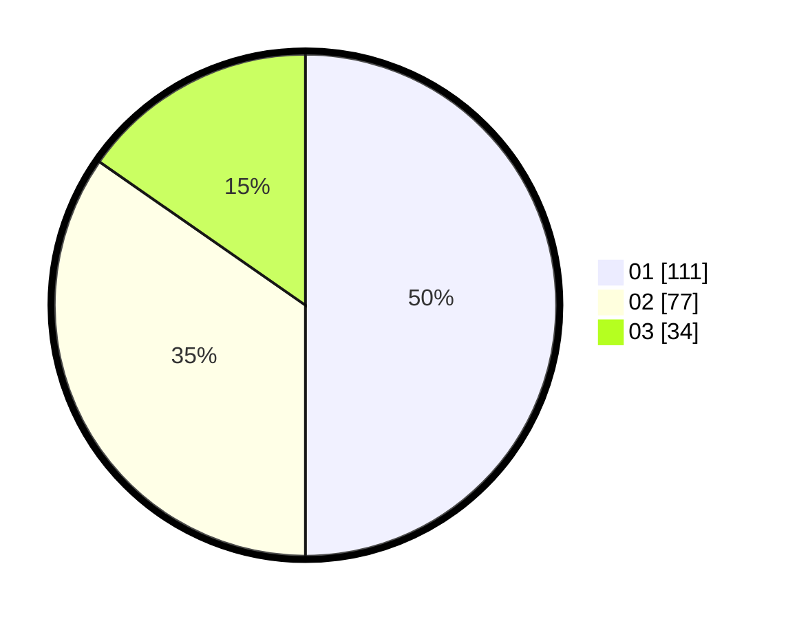

# Hasil

Hasil perolehan suara paslon dapat dilihat pada file paslon-01.txt, paslon-02.txt, dan paslon-03.txt.

Jika tidak ada, artinya data tersebut belum ada pada SIREKAP.

## Perolehan Suara

 * Paslon 01: **111**.
 * Paslon 02: **77**.
 * Paslon 03: **34**.

## Foto C Plano

https://sirekap-obj-formc.kpu.go.id/64de/pemilu/ppwp/31/71/04/10/04/3171041004073-20240215-080157--a750838d-6d0f-497a-849f-cd3467f0ed06.jpg

https://sirekap-obj-formc.kpu.go.id/64de/pemilu/ppwp/31/71/04/10/04/3171041004073-20240215-080219--81daf9ae-72dd-49cd-acb2-6314cf8ba9f7.jpg

https://sirekap-obj-formc.kpu.go.id/64de/pemilu/ppwp/31/71/04/10/04/3171041004073-20240215-080208--df8a1342-0dc5-432a-a724-4f9c136322e1.jpg

## DATA PEMILIH TETAP

Jumlah pemilih dalam DPT: **289**.
 * L: **150**.
 * P: **139**.

## DATA PENGGUNA HAK PILIH

Jumlah pengguna hak pilih dalam DPT: **213**.
 * L: **110**.
 * P: **103**.

Jumlah pengguna hak pilih dalam DPTb: **7**.
 * L: **2**.
 * P: **5**.

Jumlah pengguna hak pilih dalam DPK: **4**.
 * L: **0**.
 * P: **4**.

Jumlah pengguna hak pilih: **224**.
 * L: **112**.
 * P: **112**.

## JUMLAH SUARA SAH DAN TIDAK SAH

JUMLAH SELURUH SUARA SAH: **222**.

JUMLAH SUARA TIDAK SAH: **2**.

JUMLAH SELURUH SUARA SAH DAN SUARA TIDAK SAH: **224**.
