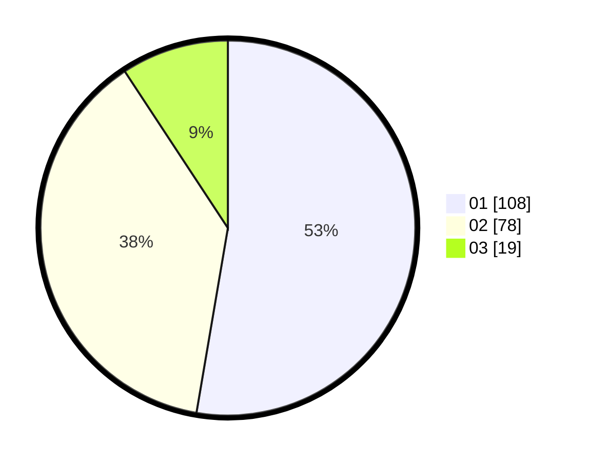

# Hasil

Hasil perolehan suara paslon dapat dilihat pada file paslon-01.txt, paslon-02.txt, dan paslon-03.txt.

Jika tidak ada, artinya data tersebut belum ada pada SIREKAP.

## Perolehan Suara

 * Paslon 01: **108**.
 * Paslon 02: **78**.
 * Paslon 03: **19**.

## Foto C Plano

https://sirekap-obj-formc.kpu.go.id/58e4/pemilu/ppwp/31/71/04/10/04/3171041004077-20240216-134630--4e0976d0-e4d1-481e-8166-68adb077b0d4.jpg

https://sirekap-obj-formc.kpu.go.id/58e4/pemilu/ppwp/31/71/04/10/04/3171041004077-20240216-134630--ec8d504f-a3a7-4d60-8629-3f8f21da861c.jpg

https://sirekap-obj-formc.kpu.go.id/58e4/pemilu/ppwp/31/71/04/10/04/3171041004077-20240216-130720--01994174-06b8-4ed4-987c-ff430bfebfb2.jpg

## DATA PEMILIH TETAP

Jumlah pemilih dalam DPT: **242**.
 * L: **124**.
 * P: **118**.

## DATA PENGGUNA HAK PILIH

Jumlah pengguna hak pilih dalam DPT: **191**.
 * L: **93**.
 * P: **98**.

Jumlah pengguna hak pilih dalam DPTb: **13**.
 * L: **0**.
 * P: **13**.

Jumlah pengguna hak pilih dalam DPK: **2**.
 * L: **1**.
 * P: **1**.

Jumlah pengguna hak pilih: **206**.
 * L: **94**.
 * P: **112**.

## JUMLAH SUARA SAH DAN TIDAK SAH

JUMLAH SELURUH SUARA SAH: **205**.

JUMLAH SUARA TIDAK SAH: **1**.

JUMLAH SELURUH SUARA SAH DAN SUARA TIDAK SAH: **206**.
