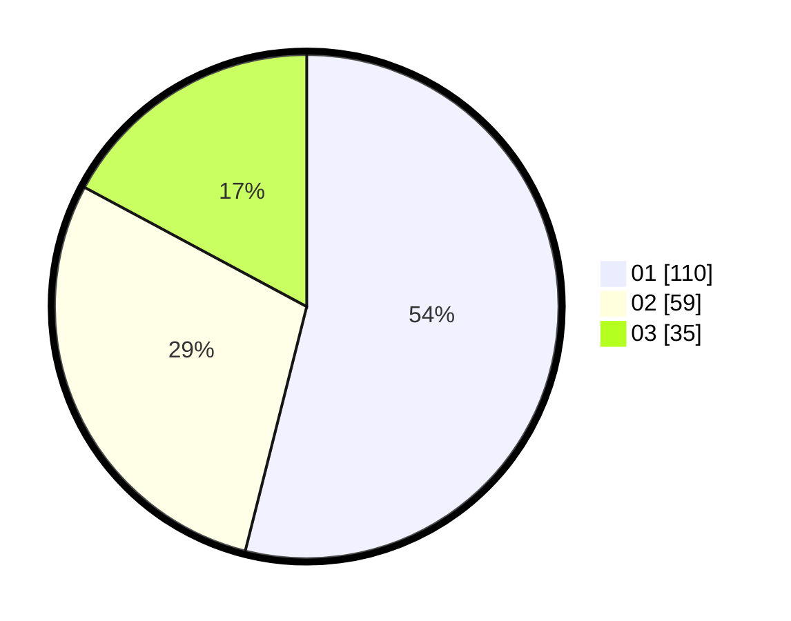

# Hasil

Hasil perolehan suara paslon dapat dilihat pada file paslon-01.txt, paslon-02.txt, dan paslon-03.txt.

Jika tidak ada, artinya data tersebut belum ada pada SIREKAP.

## Perolehan Suara

 * Paslon 01: **110**.
 * Paslon 02: **59**.
 * Paslon 03: **35**.

## Foto C Plano

https://sirekap-obj-formc.kpu.go.id/fa26/pemilu/ppwp/31/71/04/10/04/3171041004080-20240215-233444--1e8e31d0-27b3-4fe4-a1cb-3904d7cb448d.jpg

https://sirekap-obj-formc.kpu.go.id/fa26/pemilu/ppwp/31/71/04/10/04/3171041004080-20240215-233447--1778f694-660d-4e3a-a941-c1aadcfddaab.jpg

https://sirekap-obj-formc.kpu.go.id/fa26/pemilu/ppwp/31/71/04/10/04/3171041004080-20240215-233446--612ea352-d557-4eef-8ba9-85939d23865a.jpg

## DATA PEMILIH TETAP

Jumlah pemilih dalam DPT: **269**.
 * L: **134**.
 * P: **135**.

## DATA PENGGUNA HAK PILIH

Jumlah pengguna hak pilih dalam DPT: **195**.
 * L: **93**.
 * P: **102**.

Jumlah pengguna hak pilih dalam DPTb: **9**.
 * L: **3**.
 * P: **6**.

Jumlah pengguna hak pilih dalam DPK: **1**.
 * L: **0**.
 * P: **1**.

Jumlah pengguna hak pilih: **205**.
 * L: **96**.
 * P: **109**.

## JUMLAH SUARA SAH DAN TIDAK SAH

JUMLAH SELURUH SUARA SAH: **204**.

JUMLAH SUARA TIDAK SAH: **3**.

JUMLAH SELURUH SUARA SAH DAN SUARA TIDAK SAH: **207**.
