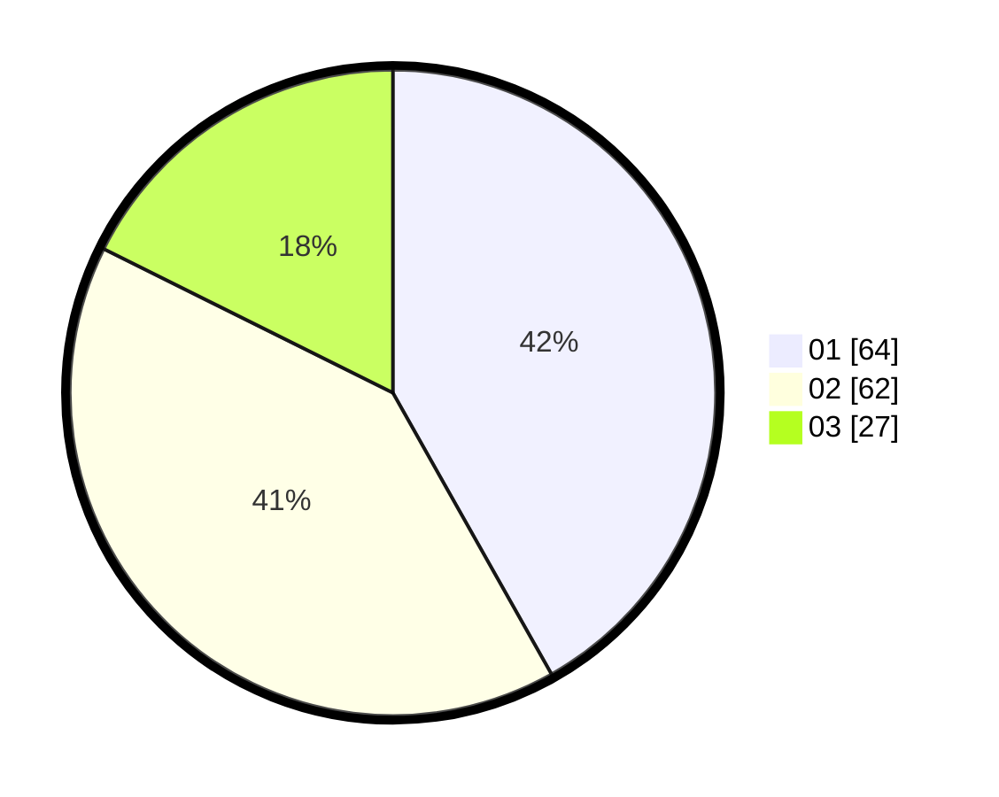

# Hasil

Hasil perolehan suara paslon dapat dilihat pada file paslon-01.txt, paslon-02.txt, dan paslon-03.txt.

Jika tidak ada, artinya data tersebut belum ada pada SIREKAP.

## Perolehan Suara

 * Paslon 01: **64**.
 * Paslon 02: **62**.
 * Paslon 03: **27**.

## Foto C Plano

https://sirekap-obj-formc.kpu.go.id/3ead/pemilu/ppwp/31/71/04/10/04/3171041004081-20240216-130924--d73f3ad0-d63d-4c88-a29a-b2bd45784b66.jpg

https://sirekap-obj-formc.kpu.go.id/3ead/pemilu/ppwp/31/71/04/10/04/3171041004081-20240216-130926--4971ff12-4062-471e-ba8d-98fde22509a5.jpg

https://sirekap-obj-formc.kpu.go.id/3ead/pemilu/ppwp/31/71/04/10/04/3171041004081-20240216-130925--55cfa04f-1d02-4f0b-b779-e591b4770d25.jpg

## DATA PEMILIH TETAP

Jumlah pemilih dalam DPT: **154**.
 * L: **75**.
 * P: **79**.

## DATA PENGGUNA HAK PILIH

Jumlah pengguna hak pilih dalam DPT: **142**.
 * L: **67**.
 * P: **75**.

Jumlah pengguna hak pilih dalam DPTb: **12**.
 * L: **8**.
 * P: **4**.

Jumlah pengguna hak pilih dalam DPK: **0**.
 * L: **0**.
 * P: **0**.

Jumlah pengguna hak pilih: **154**.
 * L: **75**.
 * P: **79**.

## JUMLAH SUARA SAH DAN TIDAK SAH

JUMLAH SELURUH SUARA SAH: **153**.

JUMLAH SUARA TIDAK SAH: **1**.

JUMLAH SELURUH SUARA SAH DAN SUARA TIDAK SAH: **154**.
