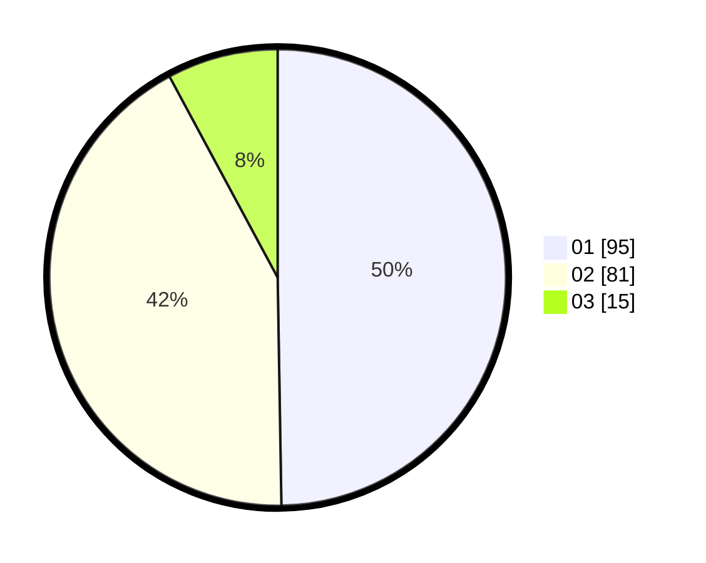

# Hasil

Hasil perolehan suara paslon dapat dilihat pada file paslon-01.txt, paslon-02.txt, dan paslon-03.txt.

Jika tidak ada, artinya data tersebut belum ada pada SIREKAP.

## Perolehan Suara

 * Paslon 01: **95**.
 * Paslon 02: **81**.
 * Paslon 03: **15**.

## Foto C Plano

https://sirekap-obj-formc.kpu.go.id/cd18/pemilu/ppwp/31/71/04/10/04/3171041004089-20240216-190459--a9cadf1f-0093-4dee-bed8-f24f97e8cbcd.jpg

https://sirekap-obj-formc.kpu.go.id/cd18/pemilu/ppwp/31/71/04/10/04/3171041004089-20240216-190500--530e926a-a3e6-4048-ad3e-6917d0f50288.jpg

https://sirekap-obj-formc.kpu.go.id/cd18/pemilu/ppwp/31/71/04/10/04/3171041004089-20240216-190459--48d26ce0-363e-4e45-85cf-55133e558605.jpg

## DATA PEMILIH TETAP

Jumlah pemilih dalam DPT: **287**.
 * L: **148**.
 * P: **139**.

## DATA PENGGUNA HAK PILIH

Jumlah pengguna hak pilih dalam DPT: **195**.
 * L: **93**.
 * P: **102**.

Jumlah pengguna hak pilih dalam DPTb: **0**.
 * L: **0**.
 * P: **0**.

Jumlah pengguna hak pilih dalam DPK: **0**.
 * L: **0**.
 * P: **0**.

Jumlah pengguna hak pilih: **195**.
 * L: **93**.
 * P: **102**.

## JUMLAH SUARA SAH DAN TIDAK SAH

JUMLAH SELURUH SUARA SAH: **191**.

JUMLAH SUARA TIDAK SAH: **4**.

JUMLAH SELURUH SUARA SAH DAN SUARA TIDAK SAH: **195**.
