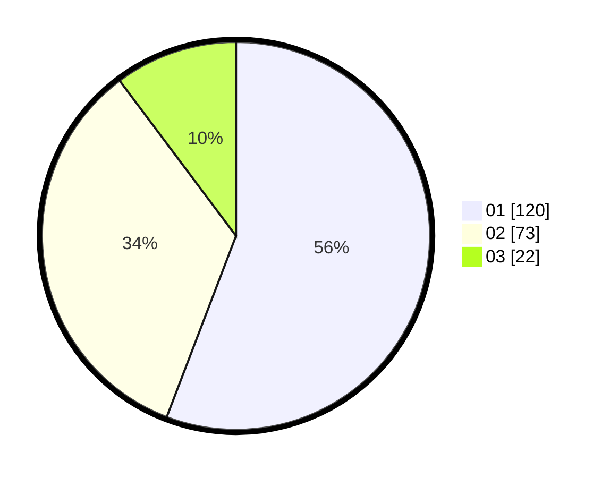

# Hasil

Hasil perolehan suara paslon dapat dilihat pada file paslon-01.txt, paslon-02.txt, dan paslon-03.txt.

Jika tidak ada, artinya data tersebut belum ada pada SIREKAP.

## Perolehan Suara

 * Paslon 01: **120**.
 * Paslon 02: **73**.
 * Paslon 03: **22**.

## Foto C Plano

https://sirekap-obj-formc.kpu.go.id/2a44/pemilu/ppwp/31/71/04/10/04/3171041004097-20240216-105448--5944623b-f257-4918-9f55-422bb4abc857.jpg

https://sirekap-obj-formc.kpu.go.id/2a44/pemilu/ppwp/31/71/04/10/04/3171041004097-20240216-105453--f89eaf0d-c042-4ee5-b897-a31bb2e49142.jpg

https://sirekap-obj-formc.kpu.go.id/2a44/pemilu/ppwp/31/71/04/10/04/3171041004097-20240216-105451--02f1a05b-02b2-4e93-a4fe-66f89023ea16.jpg

## DATA PEMILIH TETAP

Jumlah pemilih dalam DPT: **277**.
 * L: **149**.
 * P: **128**.

## DATA PENGGUNA HAK PILIH

Jumlah pengguna hak pilih dalam DPT: **216**.
 * L: **112**.
 * P: **104**.

Jumlah pengguna hak pilih dalam DPTb: **0**.
 * L: **0**.
 * P: **0**.

Jumlah pengguna hak pilih dalam DPK: **1**.
 * L: **1**.
 * P: **0**.

Jumlah pengguna hak pilih: **217**.
 * L: **113**.
 * P: **104**.

## JUMLAH SUARA SAH DAN TIDAK SAH

JUMLAH SELURUH SUARA SAH: **215**.

JUMLAH SUARA TIDAK SAH: **2**.

JUMLAH SELURUH SUARA SAH DAN SUARA TIDAK SAH: **217**.
