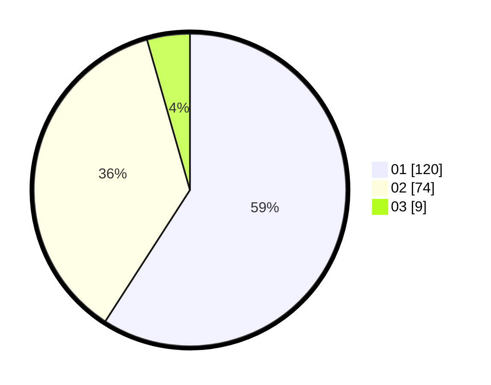

# Hasil

Hasil perolehan suara paslon dapat dilihat pada file paslon-01.txt, paslon-02.txt, dan paslon-03.txt.

Jika tidak ada, artinya data tersebut belum ada pada SIREKAP.

## Perolehan Suara

 * Paslon 01: **120**.
 * Paslon 02: **74**.
 * Paslon 03: **9**.

## Foto C Plano

https://sirekap-obj-formc.kpu.go.id/386e/pemilu/ppwp/31/71/04/10/04/3171041004098-20240216-135700--238d2492-d79e-4e46-90c5-b3b10d3180f9.jpg

https://sirekap-obj-formc.kpu.go.id/386e/pemilu/ppwp/31/71/04/10/04/3171041004098-20240216-135701--b3a84ac7-552c-46c8-b07b-34f456995d77.jpg

https://sirekap-obj-formc.kpu.go.id/386e/pemilu/ppwp/31/71/04/10/04/3171041004098-20240216-135700--a7938c14-a4b8-4d33-9c57-651d024a4e25.jpg

## DATA PEMILIH TETAP

Jumlah pemilih dalam DPT: **258**.
 * L: **128**.
 * P: **130**.

## DATA PENGGUNA HAK PILIH

Jumlah pengguna hak pilih dalam DPT: **204**.
 * L: **97**.
 * P: **107**.

Jumlah pengguna hak pilih dalam DPTb: **0**.
 * L: **0**.
 * P: **0**.

Jumlah pengguna hak pilih dalam DPK: **0**.
 * L: **0**.
 * P: **0**.

Jumlah pengguna hak pilih: **204**.
 * L: **97**.
 * P: **107**.

## JUMLAH SUARA SAH DAN TIDAK SAH

JUMLAH SELURUH SUARA SAH: **203**.

JUMLAH SUARA TIDAK SAH: **1**.

JUMLAH SELURUH SUARA SAH DAN SUARA TIDAK SAH: **204**.
