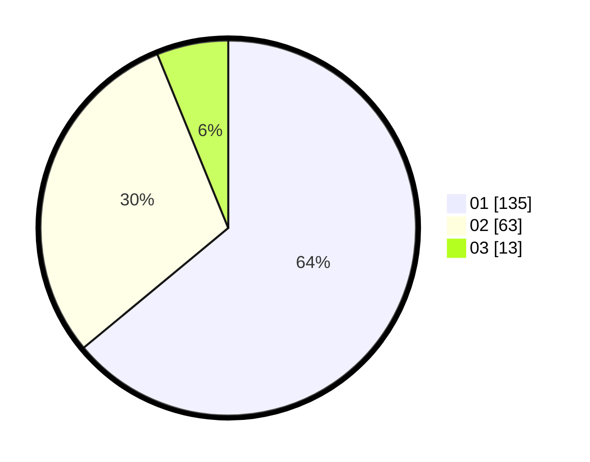

# Hasil

Hasil perolehan suara paslon dapat dilihat pada file paslon-01.txt, paslon-02.txt, dan paslon-03.txt.

Jika tidak ada, artinya data tersebut belum ada pada SIREKAP.

## Perolehan Suara

 * Paslon 01: **135**.
 * Paslon 02: **63**.
 * Paslon 03: **13**.

## Foto C Plano

https://sirekap-obj-formc.kpu.go.id/6103/pemilu/ppwp/31/71/04/10/05/3171041005012-20240214-192556--49cfe633-ca97-4e19-851d-899a539eb40d.jpg

https://sirekap-obj-formc.kpu.go.id/6103/pemilu/ppwp/31/71/04/10/05/3171041005012-20240214-192602--16a6f382-5005-4777-8c3c-7c1b79a5c5c8.jpg

https://sirekap-obj-formc.kpu.go.id/6103/pemilu/ppwp/31/71/04/10/05/3171041005012-20240214-192608--6657243a-35ce-4dd7-aed9-2c7d2b4ed2db.jpg

## DATA PEMILIH TETAP

Jumlah pemilih dalam DPT: **260**.
 * L: **130**.
 * P: **130**.

## DATA PENGGUNA HAK PILIH

Jumlah pengguna hak pilih dalam DPT: **208**.
 * L: **99**.
 * P: **109**.

Jumlah pengguna hak pilih dalam DPTb: **5**.
 * L: **4**.
 * P: **1**.

Jumlah pengguna hak pilih dalam DPK: **0**.
 * L: **0**.
 * P: **0**.

Jumlah pengguna hak pilih: **213**.
 * L: **103**.
 * P: **110**.

## JUMLAH SUARA SAH DAN TIDAK SAH

JUMLAH SELURUH SUARA SAH: **211**.

JUMLAH SUARA TIDAK SAH: **2**.

JUMLAH SELURUH SUARA SAH DAN SUARA TIDAK SAH: **213**.
