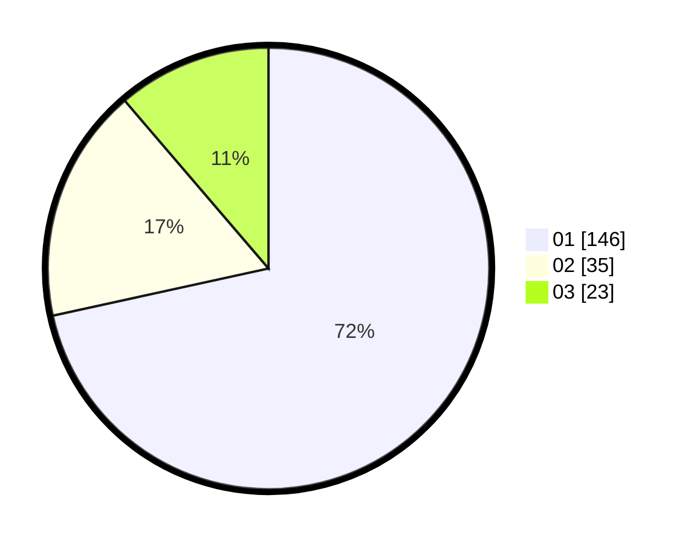

# Hasil

Hasil perolehan suara paslon dapat dilihat pada file paslon-01.txt, paslon-02.txt, dan paslon-03.txt.

Jika tidak ada, artinya data tersebut belum ada pada SIREKAP.

## Perolehan Suara

 * Paslon 01: **146**.
 * Paslon 02: **35**.
 * Paslon 03: **23**.

## Foto C Plano

https://sirekap-obj-formc.kpu.go.id/822a/pemilu/ppwp/31/71/04/10/05/3171041005013-20240214-203438--94d02a62-7901-4bf4-9b06-d1e31d501476.jpg

https://sirekap-obj-formc.kpu.go.id/822a/pemilu/ppwp/31/71/04/10/05/3171041005013-20240214-203455--4f1c2d77-37cf-4ce4-bda0-4588388865be.jpg

https://sirekap-obj-formc.kpu.go.id/822a/pemilu/ppwp/31/71/04/10/05/3171041005013-20240214-203515--7a991beb-6b3a-4bae-afc3-8c01c93b84fc.jpg

## DATA PEMILIH TETAP

Jumlah pemilih dalam DPT: **265**.
 * L: **125**.
 * P: **140**.

## DATA PENGGUNA HAK PILIH

Jumlah pengguna hak pilih dalam DPT: **208**.
 * L: **111**.
 * P: **97**.

Jumlah pengguna hak pilih dalam DPTb: **1**.
 * L: **1**.
 * P: **0**.

Jumlah pengguna hak pilih dalam DPK: **0**.
 * L: **0**.
 * P: **0**.

Jumlah pengguna hak pilih: **209**.
 * L: **112**.
 * P: **97**.

## JUMLAH SUARA SAH DAN TIDAK SAH

JUMLAH SELURUH SUARA SAH: **204**.

JUMLAH SUARA TIDAK SAH: **5**.

JUMLAH SELURUH SUARA SAH DAN SUARA TIDAK SAH: **209**.
