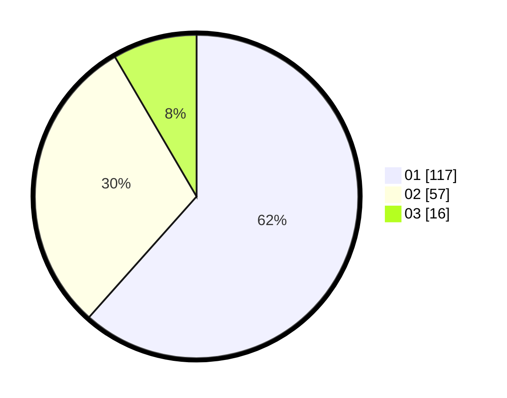

# Hasil

Hasil perolehan suara paslon dapat dilihat pada file paslon-01.txt, paslon-02.txt, dan paslon-03.txt.

Jika tidak ada, artinya data tersebut belum ada pada SIREKAP.

## Perolehan Suara

 * Paslon 01: **117**.
 * Paslon 02: **57**.
 * Paslon 03: **16**.

## Foto C Plano

https://sirekap-obj-formc.kpu.go.id/993c/pemilu/ppwp/31/71/04/10/05/3171041005016-20240214-202541--9cc3da67-8af4-486b-a406-d7ecb649cb07.jpg

https://sirekap-obj-formc.kpu.go.id/993c/pemilu/ppwp/31/71/04/10/05/3171041005016-20240214-202623--3653294c-23cd-42b0-8be3-4e72af408d04.jpg

https://sirekap-obj-formc.kpu.go.id/993c/pemilu/ppwp/31/71/04/10/05/3171041005016-20240214-202708--57067fff-5fd4-4641-9494-f829717f8834.jpg

## DATA PEMILIH TETAP

Jumlah pemilih dalam DPT: **245**.
 * L: **133**.
 * P: **112**.

## DATA PENGGUNA HAK PILIH

Jumlah pengguna hak pilih dalam DPT: **191**.
 * L: **101**.
 * P: **90**.

Jumlah pengguna hak pilih dalam DPTb: **4**.
 * L: **2**.
 * P: **2**.

Jumlah pengguna hak pilih dalam DPK: **2**.
 * L: **1**.
 * P: **1**.

Jumlah pengguna hak pilih: **197**.
 * L: **104**.
 * P: **93**.

## JUMLAH SUARA SAH DAN TIDAK SAH

JUMLAH SELURUH SUARA SAH: **190**.

JUMLAH SUARA TIDAK SAH: **7**.

JUMLAH SELURUH SUARA SAH DAN SUARA TIDAK SAH: **197**.
