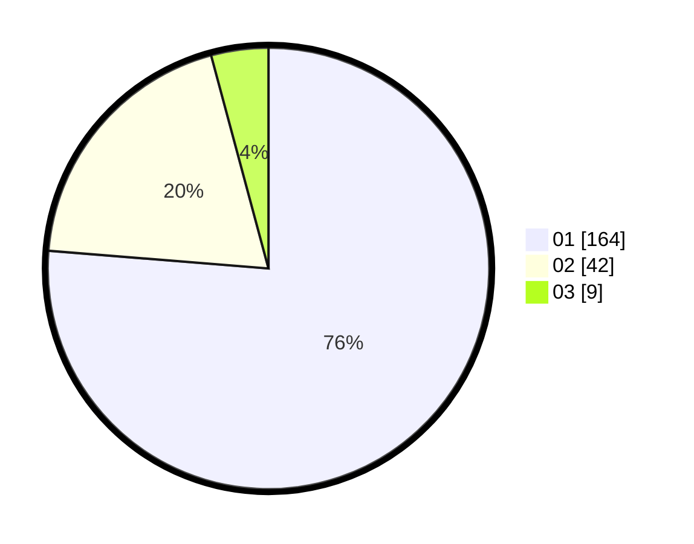

# Hasil

Hasil perolehan suara paslon dapat dilihat pada file paslon-01.txt, paslon-02.txt, dan paslon-03.txt.

Jika tidak ada, artinya data tersebut belum ada pada SIREKAP.

## Perolehan Suara

 * Paslon 01: **164**.
 * Paslon 02: **42**.
 * Paslon 03: **9**.

## Foto C Plano

https://sirekap-obj-formc.kpu.go.id/a8ef/pemilu/ppwp/31/71/04/10/05/3171041005018-20240216-025820--365678d3-2ac4-4eb1-82f6-09d7f8e7a3dd.jpg

https://sirekap-obj-formc.kpu.go.id/a8ef/pemilu/ppwp/31/71/04/10/05/3171041005018-20240216-025822--5d3e7424-8426-4453-9c71-c61414a8994d.jpg

https://sirekap-obj-formc.kpu.go.id/a8ef/pemilu/ppwp/31/71/04/10/05/3171041005018-20240216-025821--4b396fa3-6c3f-45f1-a96b-80ab39d965f7.jpg

## DATA PEMILIH TETAP

Jumlah pemilih dalam DPT: **258**.
 * L: **133**.
 * P: **125**.

## DATA PENGGUNA HAK PILIH

Jumlah pengguna hak pilih dalam DPT: **217**.
 * L: **106**.
 * P: **111**.

Jumlah pengguna hak pilih dalam DPTb: **0**.
 * L: **0**.
 * P: **0**.

Jumlah pengguna hak pilih dalam DPK: **1**.
 * L: **1**.
 * P: **0**.

Jumlah pengguna hak pilih: **218**.
 * L: **107**.
 * P: **111**.

## JUMLAH SUARA SAH DAN TIDAK SAH

JUMLAH SELURUH SUARA SAH: **215**.

JUMLAH SUARA TIDAK SAH: **3**.

JUMLAH SELURUH SUARA SAH DAN SUARA TIDAK SAH: **218**.
