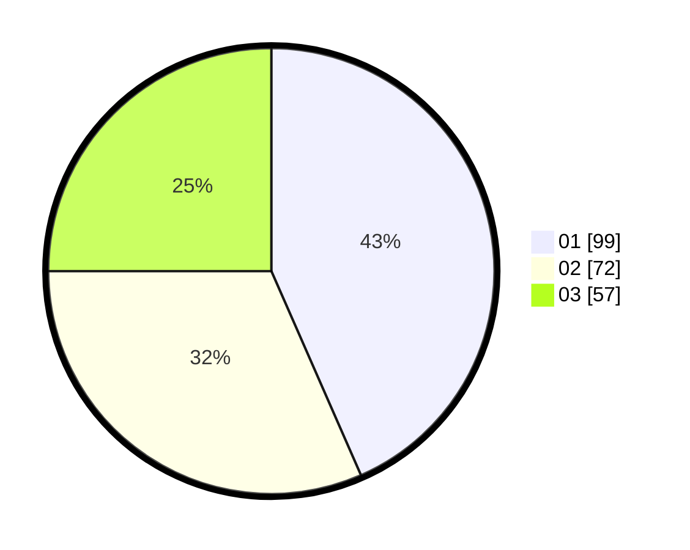

# Hasil

Hasil perolehan suara paslon dapat dilihat pada file paslon-01.txt, paslon-02.txt, dan paslon-03.txt.

Jika tidak ada, artinya data tersebut belum ada pada SIREKAP.

## Perolehan Suara

 * Paslon 01: **99**.
 * Paslon 02: **72**.
 * Paslon 03: **57**.

## Foto C Plano

https://sirekap-obj-formc.kpu.go.id/b949/pemilu/ppwp/31/71/04/10/05/3171041005024-20240214-190817--27721320-7613-4681-8025-4af5c53a333b.jpg

https://sirekap-obj-formc.kpu.go.id/b949/pemilu/ppwp/31/71/04/10/05/3171041005024-20240214-190901--bcc7a57f-e228-4502-b64c-3c41190a250e.jpg

https://sirekap-obj-formc.kpu.go.id/b949/pemilu/ppwp/31/71/04/10/05/3171041005024-20240214-190600--63aab65e-6acb-4e50-9097-c0931f5302e0.jpg

## DATA PEMILIH TETAP

Jumlah pemilih dalam DPT: **280**.
 * L: **140**.
 * P: **140**.

## DATA PENGGUNA HAK PILIH

Jumlah pengguna hak pilih dalam DPT: **212**.
 * L: **105**.
 * P: **107**.

Jumlah pengguna hak pilih dalam DPTb: **14**.
 * L: **2**.
 * P: **12**.

Jumlah pengguna hak pilih dalam DPK: **4**.
 * L: **3**.
 * P: **1**.

Jumlah pengguna hak pilih: **230**.
 * L: **110**.
 * P: **120**.

## JUMLAH SUARA SAH DAN TIDAK SAH

JUMLAH SELURUH SUARA SAH: **228**.

JUMLAH SUARA TIDAK SAH: **2**.

JUMLAH SELURUH SUARA SAH DAN SUARA TIDAK SAH: **230**.
