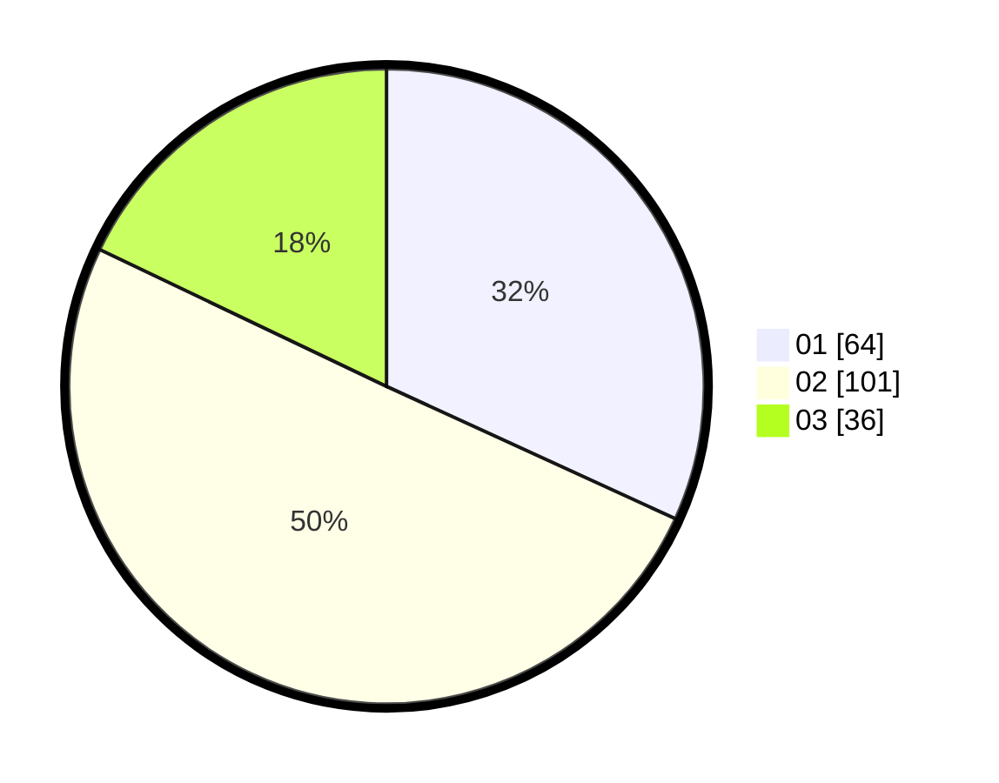

# Hasil

Hasil perolehan suara paslon dapat dilihat pada file paslon-01.txt, paslon-02.txt, dan paslon-03.txt.

Jika tidak ada, artinya data tersebut belum ada pada SIREKAP.

## Perolehan Suara

 * Paslon 01: **64**.
 * Paslon 02: **101**.
 * Paslon 03: **36**.

## Foto C Plano

https://sirekap-obj-formc.kpu.go.id/0293/pemilu/ppwp/31/71/04/10/05/3171041005027-20240214-203120--48884592-acd8-434c-9b37-b9fdf293f65b.jpg

https://sirekap-obj-formc.kpu.go.id/0293/pemilu/ppwp/31/71/04/10/05/3171041005027-20240214-203142--17f36d78-9940-430a-89bb-f7a390ddeab9.jpg

https://sirekap-obj-formc.kpu.go.id/0293/pemilu/ppwp/31/71/04/10/05/3171041005027-20240214-203151--8ae84af9-a380-44d9-88b0-509d93938328.jpg

## DATA PEMILIH TETAP

Jumlah pemilih dalam DPT: **249**.
 * L: **112**.
 * P: **127**.

## DATA PENGGUNA HAK PILIH

Jumlah pengguna hak pilih dalam DPT: **203**.
 * L: **960**.
 * P: **107**.

Jumlah pengguna hak pilih dalam DPTb: **4**.
 * L: **4**.
 * P: **0**.

Jumlah pengguna hak pilih dalam DPK: **0**.
 * L: **0**.
 * P: **0**.

Jumlah pengguna hak pilih: **207**.
 * L: **100**.
 * P: **107**.

## JUMLAH SUARA SAH DAN TIDAK SAH

JUMLAH SELURUH SUARA SAH: **201**.

JUMLAH SUARA TIDAK SAH: **6**.

JUMLAH SELURUH SUARA SAH DAN SUARA TIDAK SAH: **207**.
