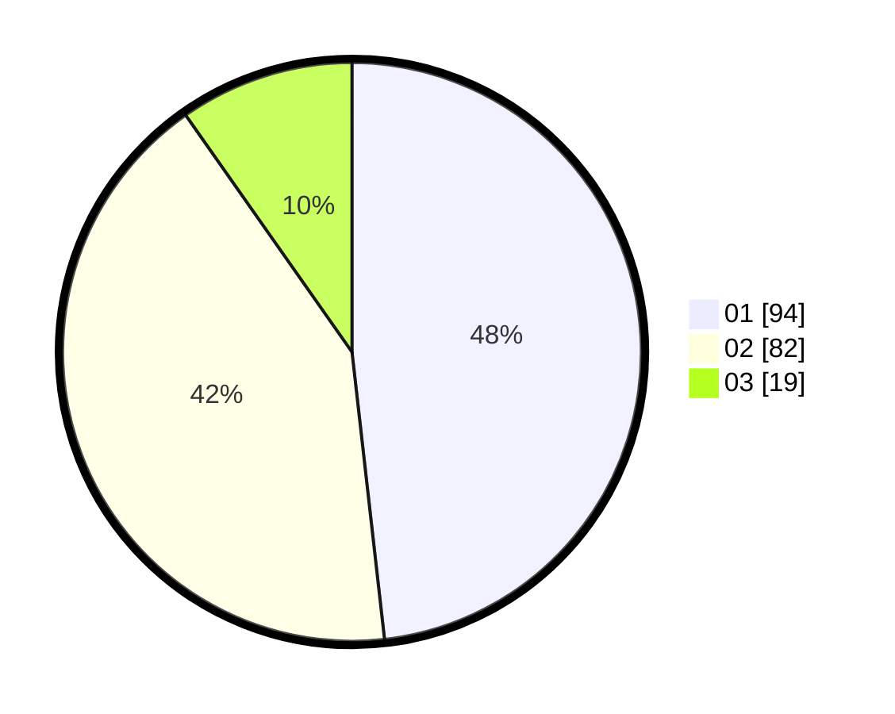

# Hasil

Hasil perolehan suara paslon dapat dilihat pada file paslon-01.txt, paslon-02.txt, dan paslon-03.txt.

Jika tidak ada, artinya data tersebut belum ada pada SIREKAP.

## Perolehan Suara

 * Paslon 01: **94**.
 * Paslon 02: **82**.
 * Paslon 03: **19**.

## Foto C Plano

https://sirekap-obj-formc.kpu.go.id/132a/pemilu/ppwp/31/71/04/10/05/3171041005031-20240214-212940--7a6922ee-1062-4af8-b8dc-1f127bd7d8bc.jpg

https://sirekap-obj-formc.kpu.go.id/132a/pemilu/ppwp/31/71/04/10/05/3171041005031-20240215-005842--7ea1e276-c04a-4c2d-85bc-7696b71cc8d9.jpg

https://sirekap-obj-formc.kpu.go.id/132a/pemilu/ppwp/31/71/04/10/05/3171041005031-20240215-005917--599e6997-ad7d-40f6-9a1f-d017b963b6a8.jpg
