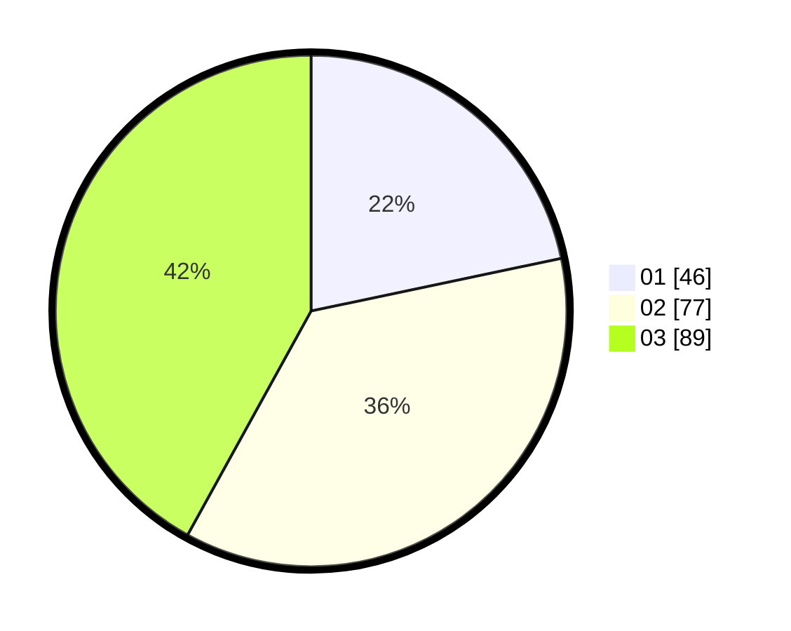

# Hasil

Hasil perolehan suara paslon dapat dilihat pada file paslon-01.txt, paslon-02.txt, dan paslon-03.txt.

Jika tidak ada, artinya data tersebut belum ada pada SIREKAP.

## Perolehan Suara

 * Paslon 01: **46**.
 * Paslon 02: **77**.
 * Paslon 03: **89**.

## Foto C Plano

https://sirekap-obj-formc.kpu.go.id/123e/pemilu/ppwp/31/71/04/10/05/3171041005040-20240214-160116--9e251108-2edb-4281-b3a6-420583e8d3fe.jpg

https://sirekap-obj-formc.kpu.go.id/123e/pemilu/ppwp/31/71/04/10/05/3171041005040-20240214-160142--9a40a4ce-fd24-4caf-a197-08716d7b0828.jpg
