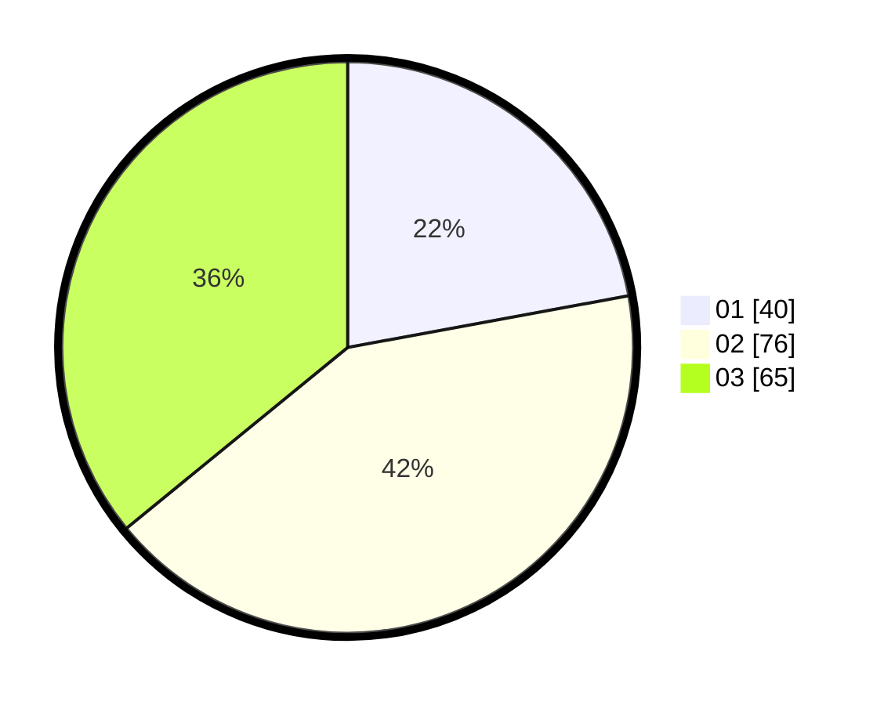

# Hasil

Hasil perolehan suara paslon dapat dilihat pada file paslon-01.txt, paslon-02.txt, dan paslon-03.txt.

Jika tidak ada, artinya data tersebut belum ada pada SIREKAP.

## Perolehan Suara

 * Paslon 01: **40**.
 * Paslon 02: **76**.
 * Paslon 03: **65**.

## Foto C Plano

https://sirekap-obj-formc.kpu.go.id/0549/pemilu/ppwp/31/71/04/10/05/3171041005042-20240216-162020--c7de6906-cef7-4364-80b4-2a339f008a90.jpg

https://sirekap-obj-formc.kpu.go.id/0549/pemilu/ppwp/31/71/04/10/05/3171041005042-20240216-155421--01d271c7-46fe-44b9-8428-37fb0c8f62b5.jpg

https://sirekap-obj-formc.kpu.go.id/0549/pemilu/ppwp/31/71/04/10/05/3171041005042-20240216-161633--991a5435-9e8e-4da7-80f8-e41ec97409f7.jpg
