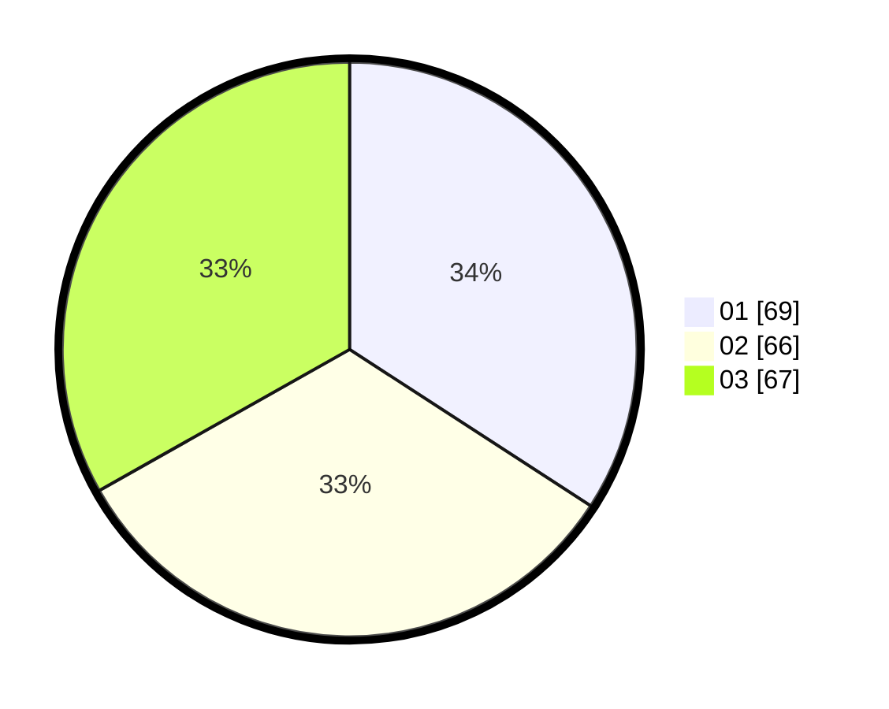

# Hasil

Hasil perolehan suara paslon dapat dilihat pada file paslon-01.txt, paslon-02.txt, dan paslon-03.txt.

Jika tidak ada, artinya data tersebut belum ada pada SIREKAP.

## Perolehan Suara

 * Paslon 01: **69**.
 * Paslon 02: **66**.
 * Paslon 03: **67**.

## Foto C Plano

https://sirekap-obj-formc.kpu.go.id/91a9/pemilu/ppwp/31/71/04/10/05/3171041005044-20240214-190403--e7e8b915-b854-4dd8-8d7f-6aa2759498d9.jpg

https://sirekap-obj-formc.kpu.go.id/91a9/pemilu/ppwp/31/71/04/10/05/3171041005044-20240214-190427--154c7f29-71af-4c5c-9b98-0b3398504f18.jpg

https://sirekap-obj-formc.kpu.go.id/91a9/pemilu/ppwp/31/71/04/10/05/3171041005044-20240214-190447--65004781-ff25-47eb-85b3-570d10ae9306.jpg

## DATA PEMILIH TETAP

Jumlah pemilih dalam DPT: **249**.
 * L: **123**.
 * P: **126**.

## DATA PENGGUNA HAK PILIH

Jumlah pengguna hak pilih dalam DPT: **186**.
 * L: **88**.
 * P: **98**.

Jumlah pengguna hak pilih dalam DPTb: **16**.
 * L: **9**.
 * P: **7**.

Jumlah pengguna hak pilih dalam DPK: **3**.
 * L: **0**.
 * P: **3**.

Jumlah pengguna hak pilih: **205**.
 * L: **97**.
 * P: **108**.

## JUMLAH SUARA SAH DAN TIDAK SAH

JUMLAH SELURUH SUARA SAH: **202**.

JUMLAH SUARA TIDAK SAH: **3**.

JUMLAH SELURUH SUARA SAH DAN SUARA TIDAK SAH: **205**.
