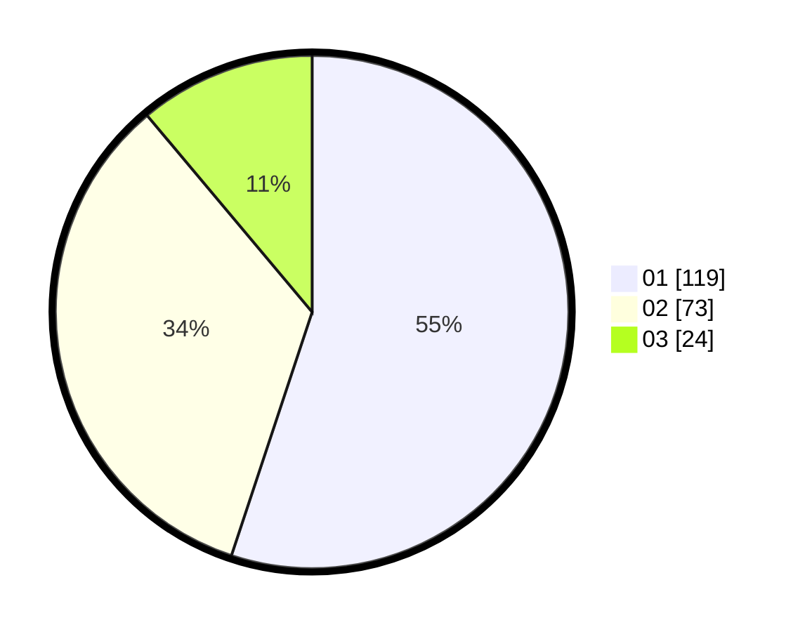

# Hasil

Hasil perolehan suara paslon dapat dilihat pada file paslon-01.txt, paslon-02.txt, dan paslon-03.txt.

Jika tidak ada, artinya data tersebut belum ada pada SIREKAP.

## Perolehan Suara

 * Paslon 01: **119**.
 * Paslon 02: **73**.
 * Paslon 03: **24**.

## Foto C Plano

https://sirekap-obj-formc.kpu.go.id/a051/pemilu/ppwp/31/71/04/10/05/3171041005045-20240214-193457--e2ce3596-29e9-4172-82e4-f78085b80c36.jpg

https://sirekap-obj-formc.kpu.go.id/a051/pemilu/ppwp/31/71/04/10/05/3171041005045-20240214-203710--72260908-1590-4d70-ac23-1fdbe45078a8.jpg
