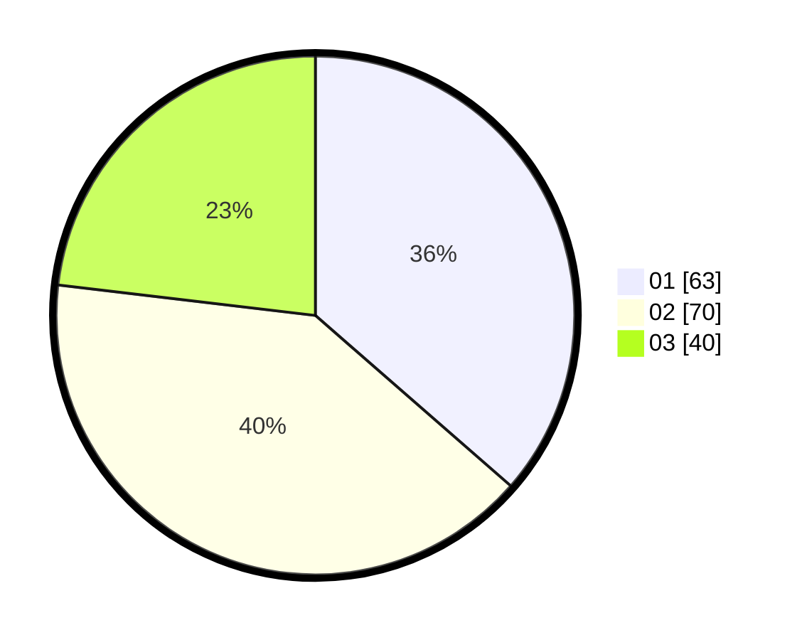

# Hasil

Hasil perolehan suara paslon dapat dilihat pada file paslon-01.txt, paslon-02.txt, dan paslon-03.txt.

Jika tidak ada, artinya data tersebut belum ada pada SIREKAP.

## Perolehan Suara

 * Paslon 01: **63**.
 * Paslon 02: **70**.
 * Paslon 03: **40**.

## Foto C Plano

https://sirekap-obj-formc.kpu.go.id/63df/pemilu/ppwp/31/71/04/10/05/3171041005051-20240214-205230--64c3c5e7-097f-4645-a948-b7a0f157c18e.jpg

https://sirekap-obj-formc.kpu.go.id/63df/pemilu/ppwp/31/71/04/10/05/3171041005051-20240214-205317--41668af0-9775-4dc9-922c-baae3f3574df.jpg

https://sirekap-obj-formc.kpu.go.id/63df/pemilu/ppwp/31/71/04/10/05/3171041005051-20240214-205427--6e01e633-4d58-452a-bacd-4f80a053744d.jpg
