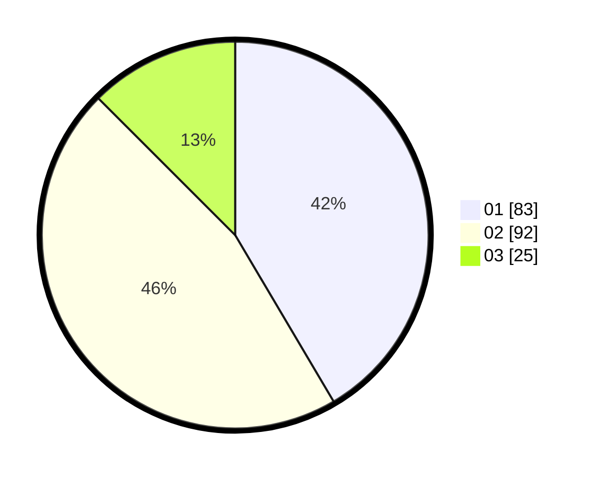

# Hasil

Hasil perolehan suara paslon dapat dilihat pada file paslon-01.txt, paslon-02.txt, dan paslon-03.txt.

Jika tidak ada, artinya data tersebut belum ada pada SIREKAP.

## Perolehan Suara

 * Paslon 01: **83**.
 * Paslon 02: **92**.
 * Paslon 03: **25**.

## Foto C Plano

https://sirekap-obj-formc.kpu.go.id/d6d6/pemilu/ppwp/31/71/04/10/06/3171041006001-20240216-205551--ed4ca05e-56bc-47fe-aea1-115af108445a.jpg

https://sirekap-obj-formc.kpu.go.id/d6d6/pemilu/ppwp/31/71/04/10/06/3171041006001-20240216-210246--c34444f7-ad86-4d35-b56c-2df1b8c9d8b4.jpg

https://sirekap-obj-formc.kpu.go.id/d6d6/pemilu/ppwp/31/71/04/10/06/3171041006001-20240216-210246--ea20c606-dc32-44ac-99dc-76f60dafd09b.jpg

## DATA PEMILIH TETAP

Jumlah pemilih dalam DPT: **276**.
 * L: **125**.
 * P: **151**.

## DATA PENGGUNA HAK PILIH

Jumlah pengguna hak pilih dalam DPT: **203**.
 * L: **88**.
 * P: **115**.

Jumlah pengguna hak pilih dalam DPTb: **18**.
 * L: **10**.
 * P: **8**.

Jumlah pengguna hak pilih dalam DPK: **2**.
 * L: **2**.
 * P: **0**.

Jumlah pengguna hak pilih: **223**.
 * L: **100**.
 * P: **123**.

## JUMLAH SUARA SAH DAN TIDAK SAH

JUMLAH SELURUH SUARA SAH: **200**.

JUMLAH SUARA TIDAK SAH: **23**.

JUMLAH SELURUH SUARA SAH DAN SUARA TIDAK SAH: **223**.
