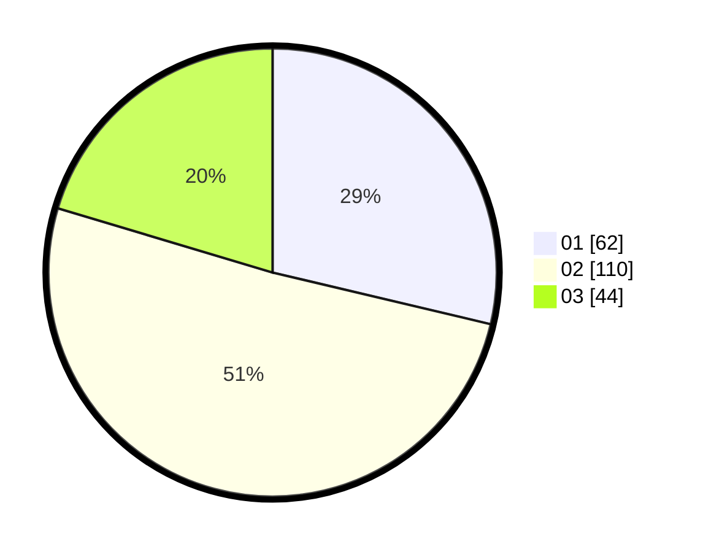

# Hasil

Hasil perolehan suara paslon dapat dilihat pada file paslon-01.txt, paslon-02.txt, dan paslon-03.txt.

Jika tidak ada, artinya data tersebut belum ada pada SIREKAP.

## Perolehan Suara

 * Paslon 01: **62**.
 * Paslon 02: **110**.
 * Paslon 03: **44**.

## Foto C Plano

https://sirekap-obj-formc.kpu.go.id/736b/pemilu/ppwp/31/71/04/10/06/3171041006002-20240216-224713--0f010274-cde3-4e4a-8d54-bb8df0af9905.jpg

https://sirekap-obj-formc.kpu.go.id/736b/pemilu/ppwp/31/71/04/10/06/3171041006002-20240216-224714--1c7df221-f9e7-4a3c-819b-60a77cef4222.jpg

https://sirekap-obj-formc.kpu.go.id/736b/pemilu/ppwp/31/71/04/10/06/3171041006002-20240216-224713--31ebb7a6-1695-422a-9bc9-ad6f0975b5a1.jpg

## DATA PEMILIH TETAP

Jumlah pemilih dalam DPT: **282**.
 * L: **141**.
 * P: **141**.

## DATA PENGGUNA HAK PILIH

Jumlah pengguna hak pilih dalam DPT: **211**.
 * L: **103**.
 * P: **108**.

Jumlah pengguna hak pilih dalam DPTb: **2**.
 * L: **1**.
 * P: **1**.

Jumlah pengguna hak pilih dalam DPK: **4**.
 * L: **1**.
 * P: **3**.

Jumlah pengguna hak pilih: **217**.
 * L: **105**.
 * P: **112**.

## JUMLAH SUARA SAH DAN TIDAK SAH

JUMLAH SELURUH SUARA SAH: **216**.

JUMLAH SUARA TIDAK SAH: **1**.

JUMLAH SELURUH SUARA SAH DAN SUARA TIDAK SAH: **217**.
