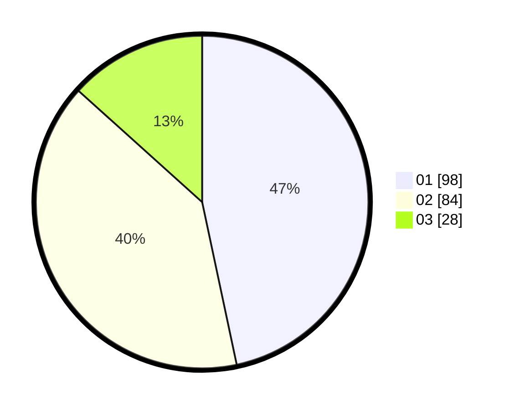

# Hasil

Hasil perolehan suara paslon dapat dilihat pada file paslon-01.txt, paslon-02.txt, dan paslon-03.txt.

Jika tidak ada, artinya data tersebut belum ada pada SIREKAP.

## Perolehan Suara

 * Paslon 01: **98**.
 * Paslon 02: **84**.
 * Paslon 03: **28**.

## Foto C Plano

https://sirekap-obj-formc.kpu.go.id/6171/pemilu/ppwp/31/71/04/10/06/3171041006005-20240215-005034--69b604ae-2da6-40e0-8bb9-30b69b5ad3ca.jpg

https://sirekap-obj-formc.kpu.go.id/6171/pemilu/ppwp/31/71/04/10/06/3171041006005-20240217-164136--de632238-da94-4bec-8b3b-509050e00648.jpg

https://sirekap-obj-formc.kpu.go.id/6171/pemilu/ppwp/31/71/04/10/06/3171041006005-20240217-164135--677c261a-c20f-4904-8be1-8198e5cf1e42.jpg

## DATA PEMILIH TETAP

Jumlah pemilih dalam DPT: **267**.
 * L: **123**.
 * P: **144**.

## DATA PENGGUNA HAK PILIH

Jumlah pengguna hak pilih dalam DPT: **200**.
 * L: **89**.
 * P: **111**.

Jumlah pengguna hak pilih dalam DPTb: **11**.
 * L: **1**.
 * P: **10**.

Jumlah pengguna hak pilih dalam DPK: **1**.
 * L: **0**.
 * P: **1**.

Jumlah pengguna hak pilih: **212**.
 * L: **90**.
 * P: **122**.

## JUMLAH SUARA SAH DAN TIDAK SAH

JUMLAH SELURUH SUARA SAH: **210**.

JUMLAH SUARA TIDAK SAH: **2**.

JUMLAH SELURUH SUARA SAH DAN SUARA TIDAK SAH: **212**.
