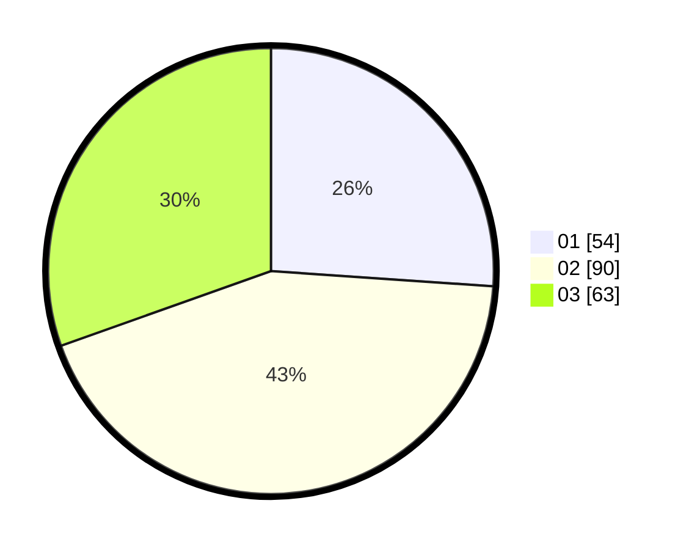

# Hasil

Hasil perolehan suara paslon dapat dilihat pada file paslon-01.txt, paslon-02.txt, dan paslon-03.txt.

Jika tidak ada, artinya data tersebut belum ada pada SIREKAP.

## Perolehan Suara

 * Paslon 01: **54**.
 * Paslon 02: **90**.
 * Paslon 03: **63**.

## Foto C Plano

https://sirekap-obj-formc.kpu.go.id/9140/pemilu/ppwp/31/71/04/10/06/3171041006018-20240217-185642--1a2bed59-5d11-4cb2-b3e9-3b50249fd0af.jpg

https://sirekap-obj-formc.kpu.go.id/9140/pemilu/ppwp/31/71/04/10/06/3171041006018-20240217-185916--22df05f3-350b-4caf-b07b-8408c5f96cd1.jpg

https://sirekap-obj-formc.kpu.go.id/9140/pemilu/ppwp/31/71/04/10/06/3171041006018-20240217-190030--302fa1f3-12f4-4b00-9c4a-38f550042096.jpg

## DATA PEMILIH TETAP

Jumlah pemilih dalam DPT: **248**.
 * L: **118**.
 * P: **130**.

## DATA PENGGUNA HAK PILIH

Jumlah pengguna hak pilih dalam DPT: **208**.
 * L: **95**.
 * P: **113**.

Jumlah pengguna hak pilih dalam DPTb: **1**.
 * L: **1**.
 * P: **0**.

Jumlah pengguna hak pilih dalam DPK: **0**.
 * L: **0**.
 * P: **0**.

Jumlah pengguna hak pilih: **209**.
 * L: **96**.
 * P: **113**.

## JUMLAH SUARA SAH DAN TIDAK SAH

JUMLAH SELURUH SUARA SAH: **207**.

JUMLAH SUARA TIDAK SAH: **2**.

JUMLAH SELURUH SUARA SAH DAN SUARA TIDAK SAH: **209**.
