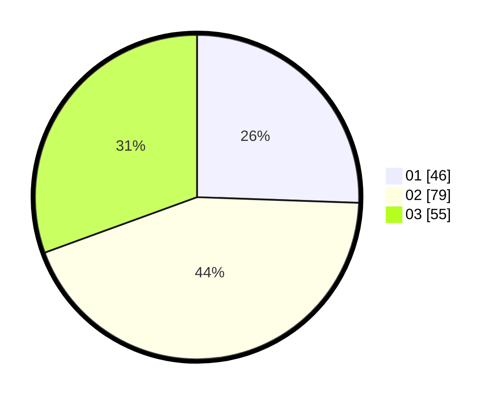

# Hasil

Hasil perolehan suara paslon dapat dilihat pada file paslon-01.txt, paslon-02.txt, dan paslon-03.txt.

Jika tidak ada, artinya data tersebut belum ada pada SIREKAP.

## Perolehan Suara

 * Paslon 01: **46**.
 * Paslon 02: **79**.
 * Paslon 03: **55**.

## Foto C Plano

https://sirekap-obj-formc.kpu.go.id/1bf6/pemilu/ppwp/31/71/04/10/06/3171041006019-20240217-194452--d355d2e7-ca9d-4af9-9142-94d1c5756c0f.jpg

https://sirekap-obj-formc.kpu.go.id/1bf6/pemilu/ppwp/31/71/04/10/06/3171041006019-20240217-194000--5c94f9e1-6cf9-4d0e-8bee-83683c60f419.jpg

https://sirekap-obj-formc.kpu.go.id/1bf6/pemilu/ppwp/31/71/04/10/06/3171041006019-20240217-194453--f46b11eb-f283-475c-a0a9-48d8adc5ea3a.jpg

## DATA PEMILIH TETAP

Jumlah pemilih dalam DPT: **251**.
 * L: **135**.
 * P: **116**.

## DATA PENGGUNA HAK PILIH

Jumlah pengguna hak pilih dalam DPT: **177**.
 * L: **88**.
 * P: **89**.

Jumlah pengguna hak pilih dalam DPTb: **4**.
 * L: **1**.
 * P: **3**.

Jumlah pengguna hak pilih dalam DPK: **4**.
 * L: **2**.
 * P: **2**.

Jumlah pengguna hak pilih: **185**.
 * L: **91**.
 * P: **94**.

## JUMLAH SUARA SAH DAN TIDAK SAH

JUMLAH SELURUH SUARA SAH: **180**.

JUMLAH SUARA TIDAK SAH: **5**.

JUMLAH SELURUH SUARA SAH DAN SUARA TIDAK SAH: **185**.
