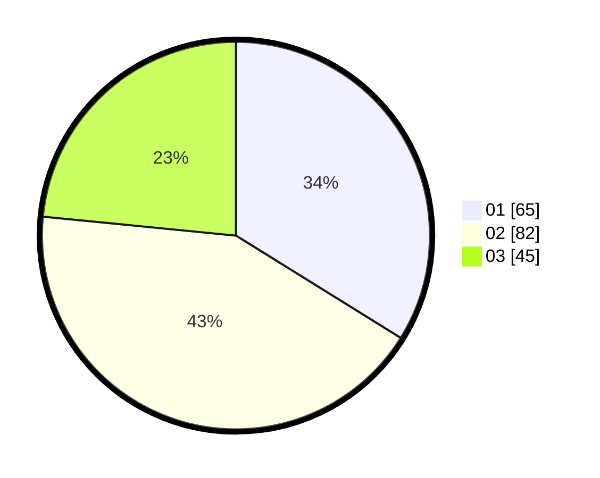

# Hasil

Hasil perolehan suara paslon dapat dilihat pada file paslon-01.txt, paslon-02.txt, dan paslon-03.txt.

Jika tidak ada, artinya data tersebut belum ada pada SIREKAP.

## Perolehan Suara

 * Paslon 01: **65**.
 * Paslon 02: **82**.
 * Paslon 03: **45**.

## Foto C Plano

https://sirekap-obj-formc.kpu.go.id/fd2d/pemilu/ppwp/31/71/04/10/06/3171041006020-20240217-141256--7f21a6b1-f7f9-49d4-b057-a0bf56651835.jpg

https://sirekap-obj-formc.kpu.go.id/fd2d/pemilu/ppwp/31/71/04/10/06/3171041006020-20240217-165126--cd17aeac-eb8e-45a7-985e-640020d232c2.jpg

https://sirekap-obj-formc.kpu.go.id/fd2d/pemilu/ppwp/31/71/04/10/06/3171041006020-20240217-141631--ae476c1e-409a-4683-b8ff-f44ae18416c3.jpg

## DATA PEMILIH TETAP

Jumlah pemilih dalam DPT: **262**.
 * L: **131**.
 * P: **131**.

## DATA PENGGUNA HAK PILIH

Jumlah pengguna hak pilih dalam DPT: **188**.
 * L: **93**.
 * P: **95**.

Jumlah pengguna hak pilih dalam DPTb: **8**.
 * L: **1**.
 * P: **7**.

Jumlah pengguna hak pilih dalam DPK: **0**.
 * L: **0**.
 * P: **0**.

Jumlah pengguna hak pilih: **196**.
 * L: **94**.
 * P: **102**.

## JUMLAH SUARA SAH DAN TIDAK SAH

JUMLAH SELURUH SUARA SAH: **192**.

JUMLAH SUARA TIDAK SAH: **4**.

JUMLAH SELURUH SUARA SAH DAN SUARA TIDAK SAH: **196**.
