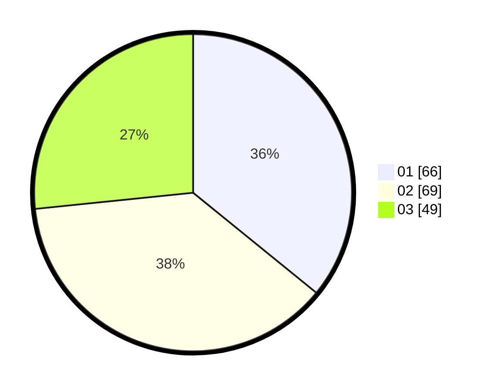

# Hasil

Hasil perolehan suara paslon dapat dilihat pada file paslon-01.txt, paslon-02.txt, dan paslon-03.txt.

Jika tidak ada, artinya data tersebut belum ada pada SIREKAP.

## Perolehan Suara

 * Paslon 01: **66**.
 * Paslon 02: **69**.
 * Paslon 03: **49**.

## Foto C Plano

https://sirekap-obj-formc.kpu.go.id/7765/pemilu/ppwp/31/71/04/10/06/3171041006021-20240217-225543--0c4e7df9-e1cd-4c42-8842-665ccedd589a.jpg

https://sirekap-obj-formc.kpu.go.id/7765/pemilu/ppwp/31/71/04/10/06/3171041006021-20240217-225545--c8ae00e7-6b3c-42c0-86ef-7f5bdc7c9d0a.jpg

https://sirekap-obj-formc.kpu.go.id/7765/pemilu/ppwp/31/71/04/10/06/3171041006021-20240217-225544--a7cfc617-7914-4931-888e-9bc1845894b5.jpg

## DATA PEMILIH TETAP

Jumlah pemilih dalam DPT: **249**.
 * L: **125**.
 * P: **124**.

## DATA PENGGUNA HAK PILIH

Jumlah pengguna hak pilih dalam DPT: **176**.
 * L: **89**.
 * P: **87**.

Jumlah pengguna hak pilih dalam DPTb: **11**.
 * L: **2**.
 * P: **9**.

Jumlah pengguna hak pilih dalam DPK: **1**.
 * L: **1**.
 * P: **0**.

Jumlah pengguna hak pilih: **188**.
 * L: **92**.
 * P: **96**.

## JUMLAH SUARA SAH DAN TIDAK SAH

JUMLAH SELURUH SUARA SAH: **184**.

JUMLAH SUARA TIDAK SAH: **4**.

JUMLAH SELURUH SUARA SAH DAN SUARA TIDAK SAH: **188**.
