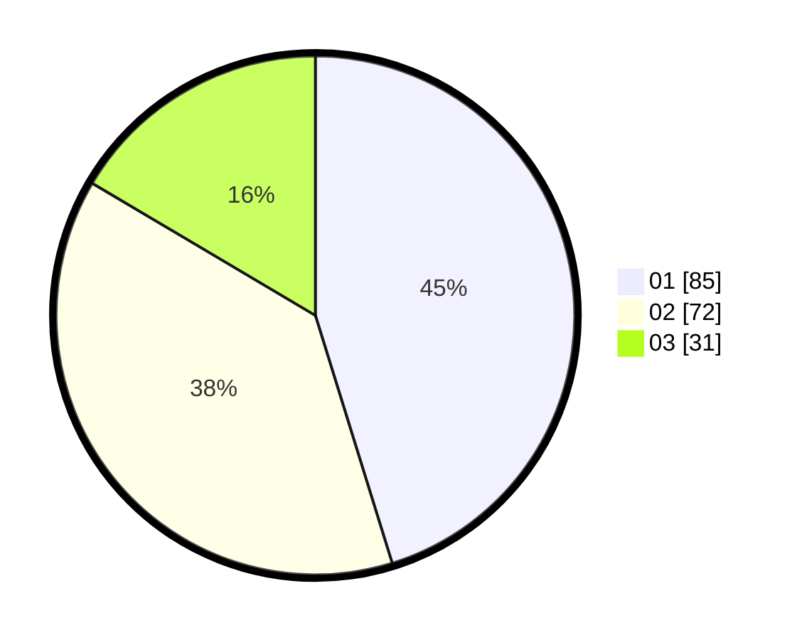

# Hasil

Hasil perolehan suara paslon dapat dilihat pada file paslon-01.txt, paslon-02.txt, dan paslon-03.txt.

Jika tidak ada, artinya data tersebut belum ada pada SIREKAP.

## Perolehan Suara

 * Paslon 01: **85**.
 * Paslon 02: **72**.
 * Paslon 03: **31**.

## Foto C Plano

https://sirekap-obj-formc.kpu.go.id/a261/pemilu/ppwp/31/71/04/10/06/3171041006022-20240215-190026--75ead247-dc38-4ec1-80ef-f5837c4cd63e.jpg

https://sirekap-obj-formc.kpu.go.id/a261/pemilu/ppwp/31/71/04/10/06/3171041006022-20240215-190051--e1250293-8d41-405d-80a9-774c78ac6df7.jpg

https://sirekap-obj-formc.kpu.go.id/a261/pemilu/ppwp/31/71/04/10/06/3171041006022-20240215-190040--af54f050-3bb0-4a7e-bad1-6c87d47e8021.jpg

## DATA PEMILIH TETAP

Jumlah pemilih dalam DPT: **265**.
 * L: **138**.
 * P: **127**.

## DATA PENGGUNA HAK PILIH

Jumlah pengguna hak pilih dalam DPT: **190**.
 * L: **95**.
 * P: **95**.

Jumlah pengguna hak pilih dalam DPTb: **0**.
 * L: **0**.
 * P: **0**.

Jumlah pengguna hak pilih dalam DPK: **1**.
 * L: **1**.
 * P: **0**.

Jumlah pengguna hak pilih: **191**.
 * L: **96**.
 * P: **95**.

## JUMLAH SUARA SAH DAN TIDAK SAH

JUMLAH SELURUH SUARA SAH: **188**.

JUMLAH SUARA TIDAK SAH: **3**.

JUMLAH SELURUH SUARA SAH DAN SUARA TIDAK SAH: **191**.
