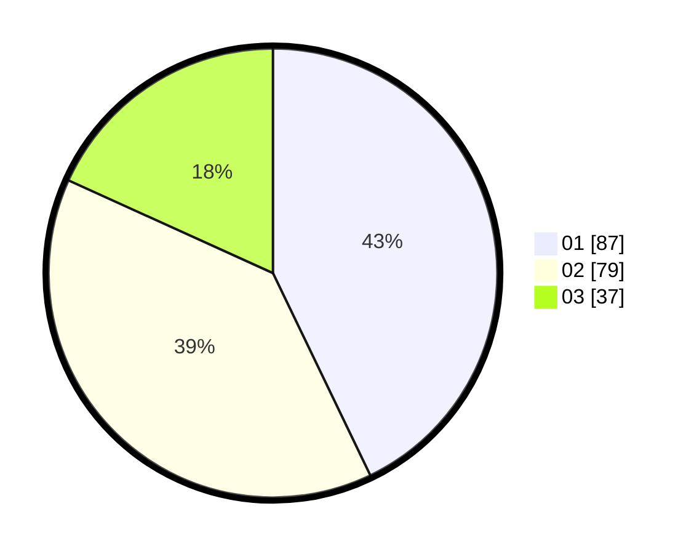

# Hasil

Hasil perolehan suara paslon dapat dilihat pada file paslon-01.txt, paslon-02.txt, dan paslon-03.txt.

Jika tidak ada, artinya data tersebut belum ada pada SIREKAP.

## Perolehan Suara

 * Paslon 01: **87**.
 * Paslon 02: **79**.
 * Paslon 03: **37**.

## Foto C Plano

https://sirekap-obj-formc.kpu.go.id/38e7/pemilu/ppwp/31/71/04/10/06/3171041006024-20240214-220513--fa7d7556-d6a6-4297-94aa-5df7b673fff6.jpg

https://sirekap-obj-formc.kpu.go.id/38e7/pemilu/ppwp/31/71/04/10/06/3171041006024-20240217-213839--4e88354f-5485-49e4-9bd7-607289f92558.jpg

https://sirekap-obj-formc.kpu.go.id/38e7/pemilu/ppwp/31/71/04/10/06/3171041006024-20240217-214201--498f073f-6723-4ed2-837f-c361f776df08.jpg

## DATA PEMILIH TETAP

Jumlah pemilih dalam DPT: **262**.
 * L: **119**.
 * P: **143**.

## DATA PENGGUNA HAK PILIH

Jumlah pengguna hak pilih dalam DPT: **195**.
 * L: **87**.
 * P: **108**.

Jumlah pengguna hak pilih dalam DPTb: **6**.
 * L: **3**.
 * P: **3**.

Jumlah pengguna hak pilih dalam DPK: **4**.
 * L: **2**.
 * P: **2**.

Jumlah pengguna hak pilih: **205**.
 * L: **92**.
 * P: **113**.

## JUMLAH SUARA SAH DAN TIDAK SAH

JUMLAH SELURUH SUARA SAH: **203**.

JUMLAH SUARA TIDAK SAH: **2**.

JUMLAH SELURUH SUARA SAH DAN SUARA TIDAK SAH: **205**.
