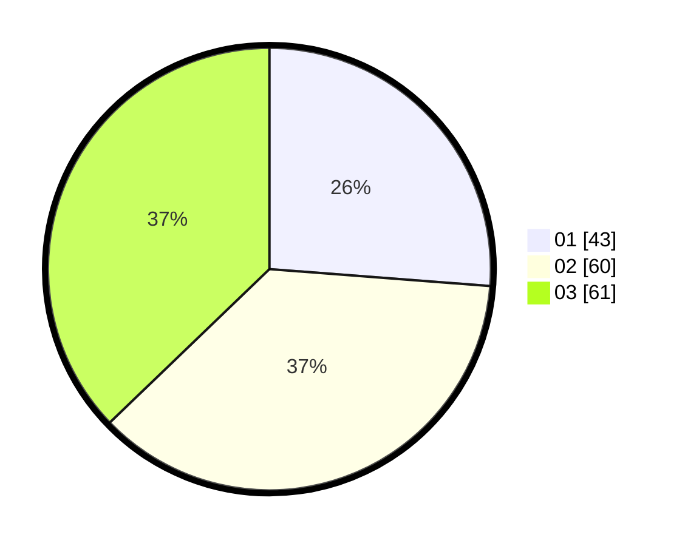

# Hasil

Hasil perolehan suara paslon dapat dilihat pada file paslon-01.txt, paslon-02.txt, dan paslon-03.txt.

Jika tidak ada, artinya data tersebut belum ada pada SIREKAP.

## Perolehan Suara

 * Paslon 01: **43**.
 * Paslon 02: **60**.
 * Paslon 03: **61**.

## Foto C Plano

https://sirekap-obj-formc.kpu.go.id/4c0e/pemilu/ppwp/31/71/04/10/06/3171041006026-20240218-103341--93463798-90a2-4e1f-bba4-c1a4ca779d89.jpg

https://sirekap-obj-formc.kpu.go.id/4c0e/pemilu/ppwp/31/71/04/10/06/3171041006026-20240218-104848--eaaded9e-9c51-47c7-b4d6-2548cb6bc1fe.jpg

https://sirekap-obj-formc.kpu.go.id/4c0e/pemilu/ppwp/31/71/04/10/06/3171041006026-20240218-105139--578a33dd-73b6-4d6b-af1b-021b74ff3797.jpg

## DATA PEMILIH TETAP

Jumlah pemilih dalam DPT: **247**.
 * L: **127**.
 * P: **120**.

## DATA PENGGUNA HAK PILIH

Jumlah pengguna hak pilih dalam DPT: **163**.
 * L: **85**.
 * P: **78**.

Jumlah pengguna hak pilih dalam DPTb: **0**.
 * L: **0**.
 * P: **0**.

Jumlah pengguna hak pilih dalam DPK: **1**.
 * L: **1**.
 * P: **0**.

Jumlah pengguna hak pilih: **164**.
 * L: **86**.
 * P: **78**.

## JUMLAH SUARA SAH DAN TIDAK SAH

JUMLAH SELURUH SUARA SAH: **164**.

JUMLAH SUARA TIDAK SAH: **0**.

JUMLAH SELURUH SUARA SAH DAN SUARA TIDAK SAH: **164**.
