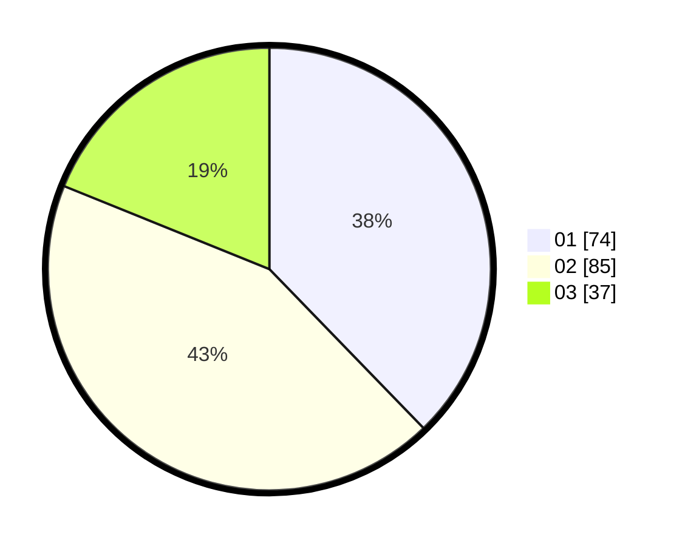

# Hasil

Hasil perolehan suara paslon dapat dilihat pada file paslon-01.txt, paslon-02.txt, dan paslon-03.txt.

Jika tidak ada, artinya data tersebut belum ada pada SIREKAP.

## Perolehan Suara

 * Paslon 01: **74**.
 * Paslon 02: **85**.
 * Paslon 03: **37**.

## Foto C Plano

https://sirekap-obj-formc.kpu.go.id/ba0d/pemilu/ppwp/31/71/04/10/06/3171041006027-20240214-202521--8f31919f-3a47-4553-814b-4604ef689bfb.jpg

https://sirekap-obj-formc.kpu.go.id/ba0d/pemilu/ppwp/31/71/04/10/06/3171041006027-20240217-190815--3ded768d-42b9-4c12-93aa-bcb6eb30f0c2.jpg

https://sirekap-obj-formc.kpu.go.id/ba0d/pemilu/ppwp/31/71/04/10/06/3171041006027-20240214-202527--10a69f2b-1ad4-44b7-9c93-02b6d0a31542.jpg

## DATA PEMILIH TETAP

Jumlah pemilih dalam DPT: **254**.
 * L: **136**.
 * P: **118**.

## DATA PENGGUNA HAK PILIH

Jumlah pengguna hak pilih dalam DPT: **195**.
 * L: **104**.
 * P: **91**.

Jumlah pengguna hak pilih dalam DPTb: **0**.
 * L: **0**.
 * P: **0**.

Jumlah pengguna hak pilih dalam DPK: **1**.
 * L: **0**.
 * P: **1**.

Jumlah pengguna hak pilih: **196**.
 * L: **104**.
 * P: **92**.

## JUMLAH SUARA SAH DAN TIDAK SAH

JUMLAH SELURUH SUARA SAH: **196**.

JUMLAH SUARA TIDAK SAH: **0**.

JUMLAH SELURUH SUARA SAH DAN SUARA TIDAK SAH: **196**.
