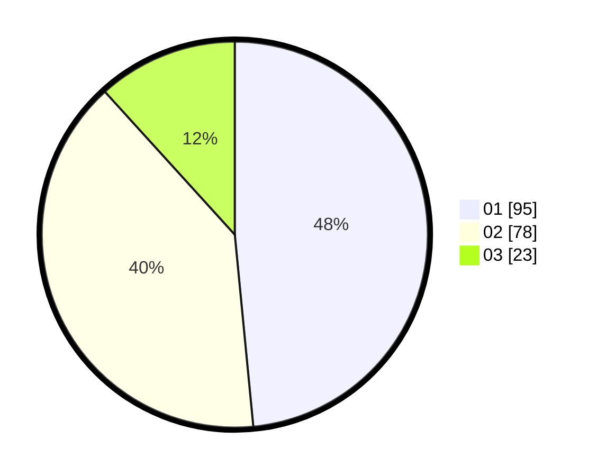

# Hasil

Hasil perolehan suara paslon dapat dilihat pada file paslon-01.txt, paslon-02.txt, dan paslon-03.txt.

Jika tidak ada, artinya data tersebut belum ada pada SIREKAP.

## Perolehan Suara

 * Paslon 01: **95**.
 * Paslon 02: **78**.
 * Paslon 03: **23**.

## Foto C Plano

https://sirekap-obj-formc.kpu.go.id/5215/pemilu/ppwp/31/71/04/10/06/3171041006028-20240217-223254--13ab0744-f06e-4862-9cbc-f0c4e8f467de.jpg

https://sirekap-obj-formc.kpu.go.id/5215/pemilu/ppwp/31/71/04/10/06/3171041006028-20240217-222122--37d259d0-dca2-41e0-ba44-5190bf723311.jpg

https://sirekap-obj-formc.kpu.go.id/5215/pemilu/ppwp/31/71/04/10/06/3171041006028-20240217-222324--963b8bba-ffd3-433b-bfc8-1d8c0771bf7e.jpg

## DATA PEMILIH TETAP

Jumlah pemilih dalam DPT: **200**.
 * L: **94**.
 * P: **106**.

## DATA PENGGUNA HAK PILIH

Jumlah pengguna hak pilih dalam DPT: **199**.
 * L: **93**.
 * P: **106**.

Jumlah pengguna hak pilih dalam DPTb: **0**.
 * L: **0**.
 * P: **0**.

Jumlah pengguna hak pilih dalam DPK: **1**.
 * L: **1**.
 * P: **0**.

Jumlah pengguna hak pilih: **200**.
 * L: **94**.
 * P: **106**.

## JUMLAH SUARA SAH DAN TIDAK SAH

JUMLAH SELURUH SUARA SAH: **196**.

JUMLAH SUARA TIDAK SAH: **4**.

JUMLAH SELURUH SUARA SAH DAN SUARA TIDAK SAH: **200**.
