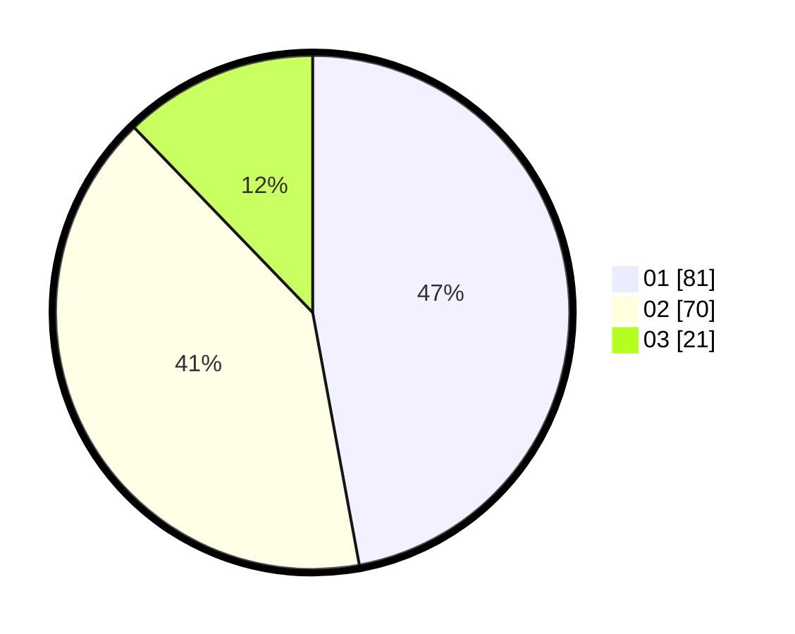

# Hasil

Hasil perolehan suara paslon dapat dilihat pada file paslon-01.txt, paslon-02.txt, dan paslon-03.txt.

Jika tidak ada, artinya data tersebut belum ada pada SIREKAP.

## Perolehan Suara

 * Paslon 01: **81**.
 * Paslon 02: **70**.
 * Paslon 03: **21**.

## Foto C Plano

https://sirekap-obj-formc.kpu.go.id/f0fe/pemilu/ppwp/31/71/04/10/06/3171041006031-20240214-180131--1c6e0a6d-6949-4aef-a189-26fdf96eea64.jpg

https://sirekap-obj-formc.kpu.go.id/f0fe/pemilu/ppwp/31/71/04/10/06/3171041006031-20240214-155344--a6039d86-d513-4289-a9ec-3e65ec52a9ff.jpg

https://sirekap-obj-formc.kpu.go.id/f0fe/pemilu/ppwp/31/71/04/10/06/3171041006031-20240214-155423--f551e433-aa4a-44fb-942d-0ed425cdfc99.jpg

## DATA PEMILIH TETAP

Jumlah pemilih dalam DPT: **235**.
 * L: **112**.
 * P: **123**.

## DATA PENGGUNA HAK PILIH

Jumlah pengguna hak pilih dalam DPT: **165**.
 * L: **76**.
 * P: **89**.

Jumlah pengguna hak pilih dalam DPTb: **1**.
 * L: **1**.
 * P: **0**.

Jumlah pengguna hak pilih dalam DPK: **9**.
 * L: **1**.
 * P: **8**.

Jumlah pengguna hak pilih: **175**.
 * L: **78**.
 * P: **97**.

## JUMLAH SUARA SAH DAN TIDAK SAH

JUMLAH SELURUH SUARA SAH: **172**.

JUMLAH SUARA TIDAK SAH: **3**.

JUMLAH SELURUH SUARA SAH DAN SUARA TIDAK SAH: **175**.
