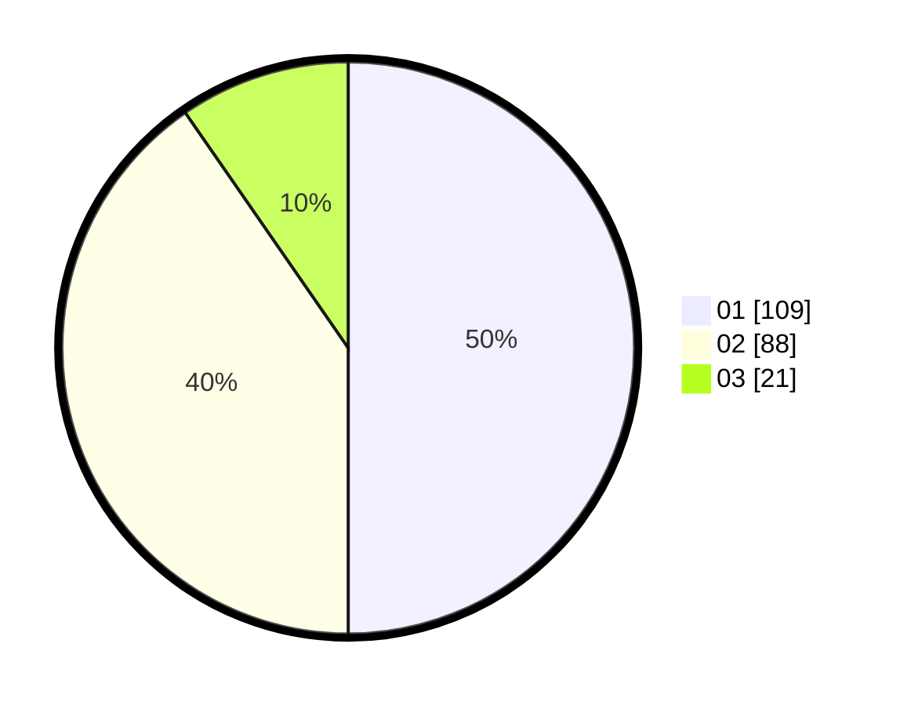

# Hasil

Hasil perolehan suara paslon dapat dilihat pada file paslon-01.txt, paslon-02.txt, dan paslon-03.txt.

Jika tidak ada, artinya data tersebut belum ada pada SIREKAP.

## Perolehan Suara

 * Paslon 01: **109**.
 * Paslon 02: **88**.
 * Paslon 03: **21**.

## Foto C Plano

https://sirekap-obj-formc.kpu.go.id/9148/pemilu/ppwp/31/71/04/10/06/3171041006034-20240218-182354--844e1c6e-b579-44b4-97f8-e1045660f06e.jpg

https://sirekap-obj-formc.kpu.go.id/9148/pemilu/ppwp/31/71/04/10/06/3171041006034-20240218-190026--8710e601-e217-4af3-b074-711bdfae2569.jpg

https://sirekap-obj-formc.kpu.go.id/9148/pemilu/ppwp/31/71/04/10/06/3171041006034-20240218-190159--63ff28f5-2bfb-4d64-aae2-49a496669412.jpg

## DATA PEMILIH TETAP

Jumlah pemilih dalam DPT: **286**.
 * L: **140**.
 * P: **146**.

## DATA PENGGUNA HAK PILIH

Jumlah pengguna hak pilih dalam DPT: **229**.
 * L: **109**.
 * P: **120**.

Jumlah pengguna hak pilih dalam DPTb: **0**.
 * L: **0**.
 * P: **0**.

Jumlah pengguna hak pilih dalam DPK: **0**.
 * L: **0**.
 * P: **0**.

Jumlah pengguna hak pilih: **229**.
 * L: **109**.
 * P: **120**.

## JUMLAH SUARA SAH DAN TIDAK SAH

JUMLAH SELURUH SUARA SAH: **218**.

JUMLAH SUARA TIDAK SAH: **11**.

JUMLAH SELURUH SUARA SAH DAN SUARA TIDAK SAH: **229**.
