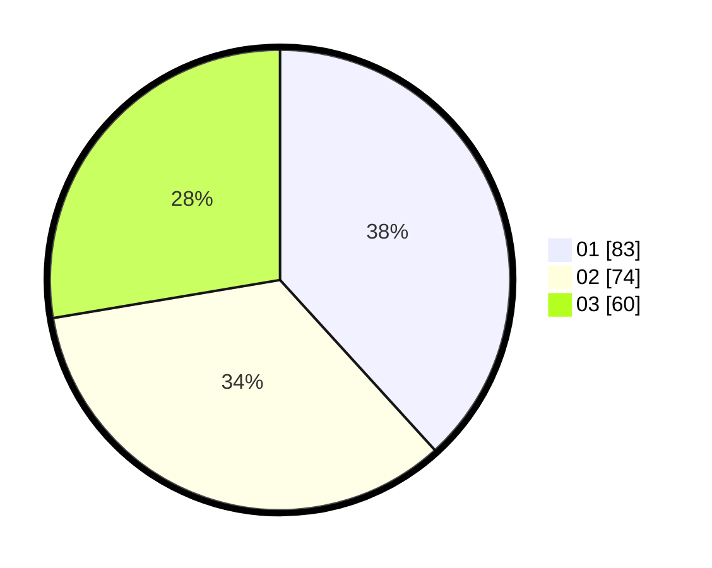

# Hasil

Hasil perolehan suara paslon dapat dilihat pada file paslon-01.txt, paslon-02.txt, dan paslon-03.txt.

Jika tidak ada, artinya data tersebut belum ada pada SIREKAP.

## Perolehan Suara

 * Paslon 01: **83**.
 * Paslon 02: **74**.
 * Paslon 03: **60**.

## Foto C Plano

https://sirekap-obj-formc.kpu.go.id/4640/pemilu/ppwp/31/71/04/10/06/3171041006049-20240214-193032--f76bc5a2-a13d-409e-8d63-7db8dd4d5eb8.jpg

https://sirekap-obj-formc.kpu.go.id/4640/pemilu/ppwp/31/71/04/10/06/3171041006049-20240214-193150--b221bbca-810a-4729-9363-95f8833d432e.jpg

https://sirekap-obj-formc.kpu.go.id/4640/pemilu/ppwp/31/71/04/10/06/3171041006049-20240214-185258--4ec02d04-1357-44e2-9b27-0b9d9b7c339c.jpg

## DATA PEMILIH TETAP

Jumlah pemilih dalam DPT: **278**.
 * L: **131**.
 * P: **147**.

## DATA PENGGUNA HAK PILIH

Jumlah pengguna hak pilih dalam DPT: **207**.
 * L: **94**.
 * P: **113**.

Jumlah pengguna hak pilih dalam DPTb: **8**.
 * L: **3**.
 * P: **5**.

Jumlah pengguna hak pilih dalam DPK: **7**.
 * L: **4**.
 * P: **3**.

Jumlah pengguna hak pilih: **222**.
 * L: **101**.
 * P: **121**.

## JUMLAH SUARA SAH DAN TIDAK SAH

JUMLAH SELURUH SUARA SAH: **217**.

JUMLAH SUARA TIDAK SAH: **5**.

JUMLAH SELURUH SUARA SAH DAN SUARA TIDAK SAH: **222**.
