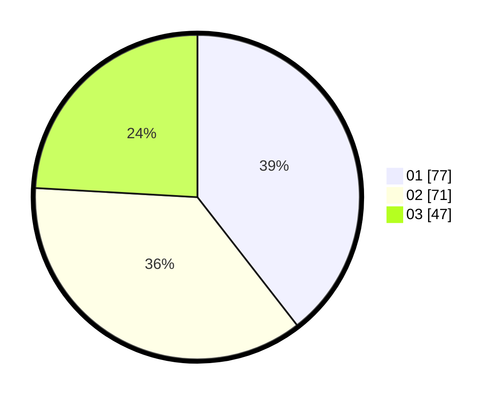

# Hasil

Hasil perolehan suara paslon dapat dilihat pada file paslon-01.txt, paslon-02.txt, dan paslon-03.txt.

Jika tidak ada, artinya data tersebut belum ada pada SIREKAP.

## Perolehan Suara

 * Paslon 01: **77**.
 * Paslon 02: **71**.
 * Paslon 03: **47**.

## Foto C Plano

https://sirekap-obj-formc.kpu.go.id/9c35/pemilu/ppwp/31/71/04/10/06/3171041006050-20240214-220349--471470ca-e3e1-4070-8b90-1d0efe48a1aa.jpg

https://sirekap-obj-formc.kpu.go.id/9c35/pemilu/ppwp/31/71/04/10/06/3171041006050-20240217-153945--071091cb-de81-48ce-bede-bd8a81300f7c.jpg

https://sirekap-obj-formc.kpu.go.id/9c35/pemilu/ppwp/31/71/04/10/06/3171041006050-20240217-154223--68c1ebd1-5f39-4c68-9d15-d81adbd7e3b6.jpg

## DATA PEMILIH TETAP

Jumlah pemilih dalam DPT: **266**.
 * L: **127**.
 * P: **139**.

## DATA PENGGUNA HAK PILIH

Jumlah pengguna hak pilih dalam DPT: **189**.
 * L: **88**.
 * P: **101**.

Jumlah pengguna hak pilih dalam DPTb: **5**.
 * L: **0**.
 * P: **5**.

Jumlah pengguna hak pilih dalam DPK: **2**.
 * L: **2**.
 * P: **0**.

Jumlah pengguna hak pilih: **196**.
 * L: **90**.
 * P: **106**.

## JUMLAH SUARA SAH DAN TIDAK SAH

JUMLAH SELURUH SUARA SAH: **195**.

JUMLAH SUARA TIDAK SAH: **1**.

JUMLAH SELURUH SUARA SAH DAN SUARA TIDAK SAH: **196**.
