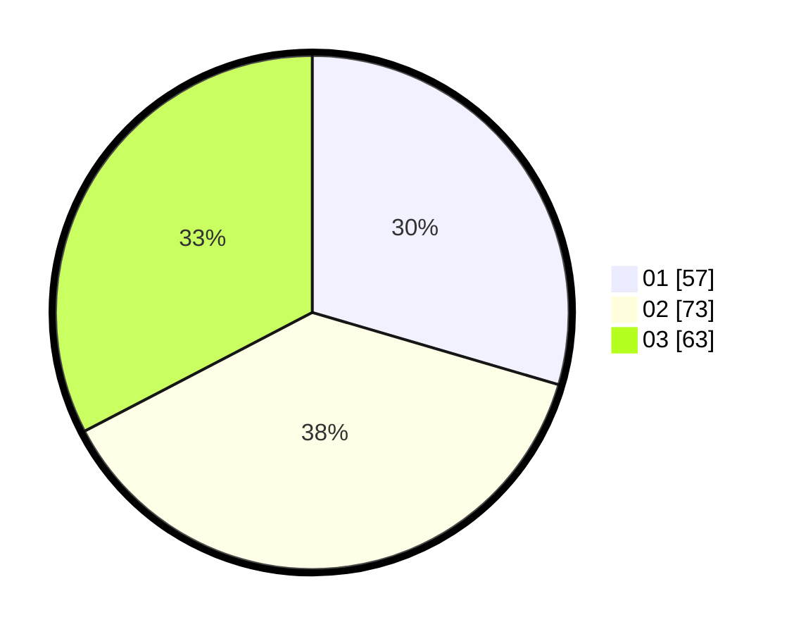

# Hasil

Hasil perolehan suara paslon dapat dilihat pada file paslon-01.txt, paslon-02.txt, dan paslon-03.txt.

Jika tidak ada, artinya data tersebut belum ada pada SIREKAP.

## Perolehan Suara

 * Paslon 01: **57**.
 * Paslon 02: **73**.
 * Paslon 03: **63**.

## Foto C Plano

https://sirekap-obj-formc.kpu.go.id/35cb/pemilu/ppwp/31/71/04/10/06/3171041006052-20240216-191315--c3e15cb3-1e6f-441c-a798-77ade4d82b13.jpg

https://sirekap-obj-formc.kpu.go.id/35cb/pemilu/ppwp/31/71/04/10/06/3171041006052-20240217-152548--c30cff91-c2d6-4ead-9f06-9ab946eedfd9.jpg

https://sirekap-obj-formc.kpu.go.id/35cb/pemilu/ppwp/31/71/04/10/06/3171041006052-20240216-185109--94641498-68a6-4c07-8dcd-bb1ff1de3133.jpg

## DATA PEMILIH TETAP

Jumlah pemilih dalam DPT: **265**.
 * L: **115**.
 * P: **150**.

## DATA PENGGUNA HAK PILIH

Jumlah pengguna hak pilih dalam DPT: **192**.
 * L: **77**.
 * P: **115**.

Jumlah pengguna hak pilih dalam DPTb: **2**.
 * L: **0**.
 * P: **2**.

Jumlah pengguna hak pilih dalam DPK: **4**.
 * L: **1**.
 * P: **3**.

Jumlah pengguna hak pilih: **198**.
 * L: **78**.
 * P: **120**.

## JUMLAH SUARA SAH DAN TIDAK SAH

JUMLAH SELURUH SUARA SAH: **193**.

JUMLAH SUARA TIDAK SAH: **5**.

JUMLAH SELURUH SUARA SAH DAN SUARA TIDAK SAH: **198**.
