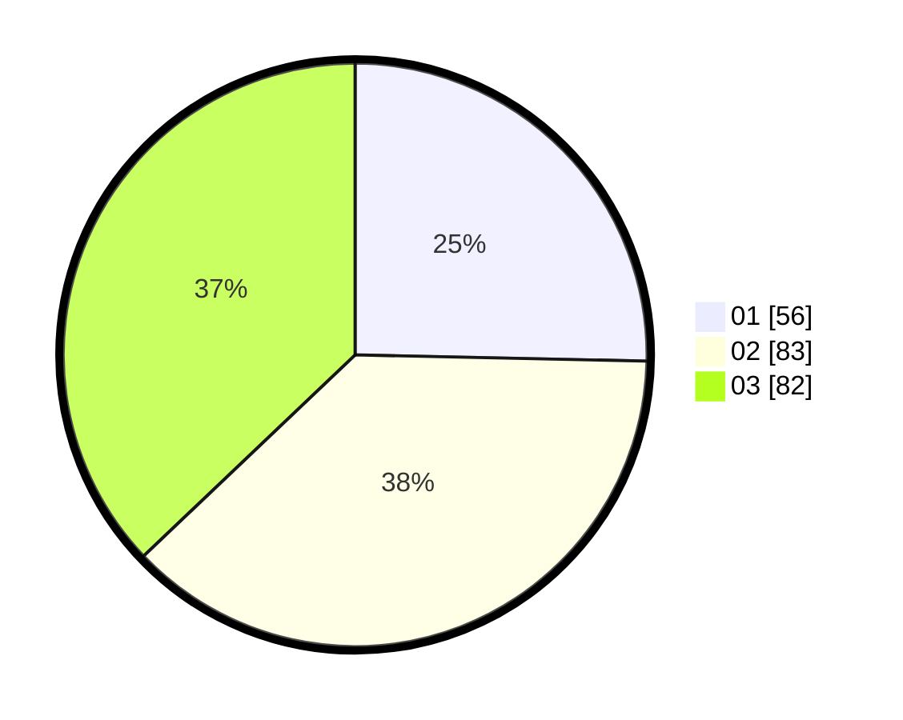

# Hasil

Hasil perolehan suara paslon dapat dilihat pada file paslon-01.txt, paslon-02.txt, dan paslon-03.txt.

Jika tidak ada, artinya data tersebut belum ada pada SIREKAP.

## Perolehan Suara

 * Paslon 01: **56**.
 * Paslon 02: **83**.
 * Paslon 03: **82**.

## Foto C Plano

https://sirekap-obj-formc.kpu.go.id/2c0b/pemilu/ppwp/31/71/04/10/06/3171041006053-20240216-163121--1378ec34-e72b-4515-815b-918340fb3764.jpg

https://sirekap-obj-formc.kpu.go.id/2c0b/pemilu/ppwp/31/71/04/10/06/3171041006053-20240216-165339--68bea6b8-25cd-4591-a2b8-2747fca86b61.jpg

https://sirekap-obj-formc.kpu.go.id/2c0b/pemilu/ppwp/31/71/04/10/06/3171041006053-20240216-165617--2eb958bd-bbd7-4cea-96d6-d4227706d081.jpg

## DATA PEMILIH TETAP

Jumlah pemilih dalam DPT: **274**.
 * L: **118**.
 * P: **156**.

## DATA PENGGUNA HAK PILIH

Jumlah pengguna hak pilih dalam DPT: **217**.
 * L: **96**.
 * P: **121**.

Jumlah pengguna hak pilih dalam DPTb: **7**.
 * L: **1**.
 * P: **6**.

Jumlah pengguna hak pilih dalam DPK: **0**.
 * L: **0**.
 * P: **0**.

Jumlah pengguna hak pilih: **224**.
 * L: **97**.
 * P: **127**.

## JUMLAH SUARA SAH DAN TIDAK SAH

JUMLAH SELURUH SUARA SAH: **221**.

JUMLAH SUARA TIDAK SAH: **3**.

JUMLAH SELURUH SUARA SAH DAN SUARA TIDAK SAH: **224**.
