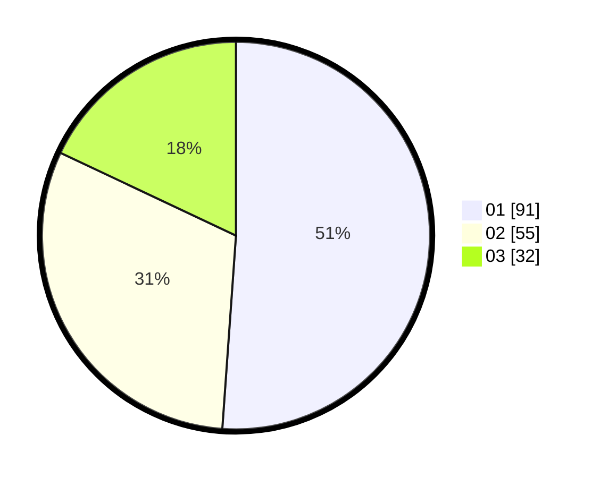

# Hasil

Hasil perolehan suara paslon dapat dilihat pada file paslon-01.txt, paslon-02.txt, dan paslon-03.txt.

Jika tidak ada, artinya data tersebut belum ada pada SIREKAP.

## Perolehan Suara

 * Paslon 01: **91**.
 * Paslon 02: **55**.
 * Paslon 03: **32**.

## Foto C Plano

https://sirekap-obj-formc.kpu.go.id/c28e/pemilu/ppwp/31/71/04/10/06/3171041006056-20240219-121914--4d636887-3f51-46d5-bd22-e90fbb42ea71.jpg

https://sirekap-obj-formc.kpu.go.id/c28e/pemilu/ppwp/31/71/04/10/06/3171041006056-20240219-122005--6e878f3f-6bfc-41f5-a21f-a834109a2561.jpg

https://sirekap-obj-formc.kpu.go.id/c28e/pemilu/ppwp/31/71/04/10/06/3171041006056-20240219-122110--22dbf394-a344-40c3-b17f-5e46f93a7890.jpg

## DATA PEMILIH TETAP

Jumlah pemilih dalam DPT: **243**.
 * L: **122**.
 * P: **121**.

## DATA PENGGUNA HAK PILIH

Jumlah pengguna hak pilih dalam DPT: **177**.
 * L: **87**.
 * P: **90**.

Jumlah pengguna hak pilih dalam DPTb: **0**.
 * L: **0**.
 * P: **0**.

Jumlah pengguna hak pilih dalam DPK: **3**.
 * L: **0**.
 * P: **3**.

Jumlah pengguna hak pilih: **180**.
 * L: **87**.
 * P: **93**.

## JUMLAH SUARA SAH DAN TIDAK SAH

JUMLAH SELURUH SUARA SAH: **178**.

JUMLAH SUARA TIDAK SAH: **2**.

JUMLAH SELURUH SUARA SAH DAN SUARA TIDAK SAH: **180**.
