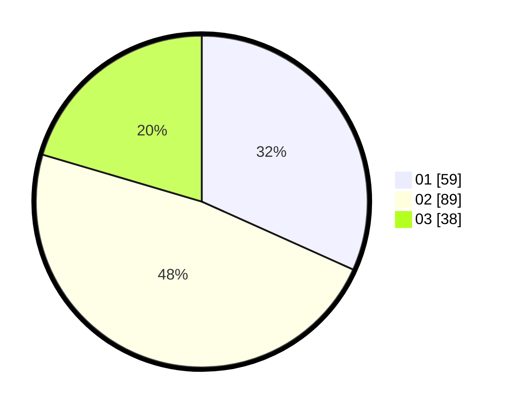

# Hasil

Hasil perolehan suara paslon dapat dilihat pada file paslon-01.txt, paslon-02.txt, dan paslon-03.txt.

Jika tidak ada, artinya data tersebut belum ada pada SIREKAP.

## Perolehan Suara

 * Paslon 01: **59**.
 * Paslon 02: **89**.
 * Paslon 03: **38**.

## Foto C Plano

https://sirekap-obj-formc.kpu.go.id/6492/pemilu/ppwp/31/71/04/10/06/3171041006057-20240219-190413--0c3f66d0-d9f5-4642-906a-c1ad25448675.jpg

https://sirekap-obj-formc.kpu.go.id/6492/pemilu/ppwp/31/71/04/10/06/3171041006057-20240215-001814--119b692c-e027-46be-8816-76dfe7077ddb.jpg

https://sirekap-obj-formc.kpu.go.id/6492/pemilu/ppwp/31/71/04/10/06/3171041006057-20240215-001856--4a7737e7-3894-4b7c-8200-52e63a8f6e2e.jpg
