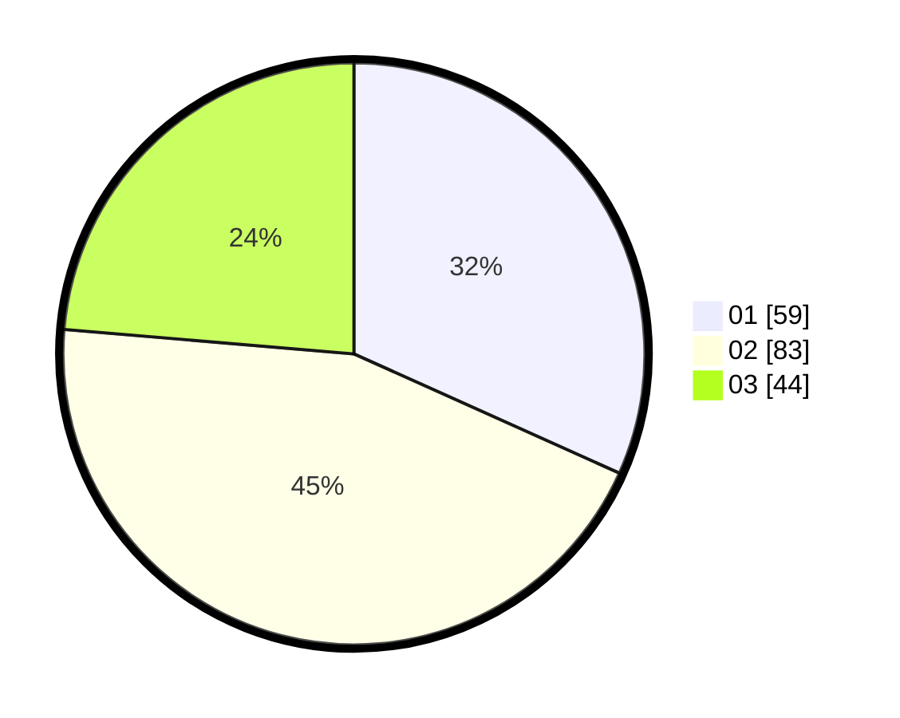

# Hasil

Hasil perolehan suara paslon dapat dilihat pada file paslon-01.txt, paslon-02.txt, dan paslon-03.txt.

Jika tidak ada, artinya data tersebut belum ada pada SIREKAP.

## Perolehan Suara

 * Paslon 01: **59**.
 * Paslon 02: **83**.
 * Paslon 03: **44**.

## Foto C Plano

https://sirekap-obj-formc.kpu.go.id/81b3/pemilu/ppwp/31/71/04/10/06/3171041006059-20240217-200549--00183ae6-d3f5-4dda-85cc-13c2173bc077.jpg

https://sirekap-obj-formc.kpu.go.id/81b3/pemilu/ppwp/31/71/04/10/06/3171041006059-20240217-201341--481a0d17-ac70-4a1f-a36c-8d7bea42f1b4.jpg

https://sirekap-obj-formc.kpu.go.id/81b3/pemilu/ppwp/31/71/04/10/06/3171041006059-20240217-201628--d623b904-fbb6-4aa5-87c4-f0154f4de90d.jpg

## DATA PEMILIH TETAP

Jumlah pemilih dalam DPT: **266**.
 * L: **110**.
 * P: **156**.

## DATA PENGGUNA HAK PILIH

Jumlah pengguna hak pilih dalam DPT: **176**.
 * L: **75**.
 * P: **101**.

Jumlah pengguna hak pilih dalam DPTb: **11**.
 * L: **5**.
 * P: **6**.

Jumlah pengguna hak pilih dalam DPK: **3**.
 * L: **0**.
 * P: **3**.

Jumlah pengguna hak pilih: **190**.
 * L: **80**.
 * P: **110**.

## JUMLAH SUARA SAH DAN TIDAK SAH

JUMLAH SELURUH SUARA SAH: **186**.

JUMLAH SUARA TIDAK SAH: **4**.

JUMLAH SELURUH SUARA SAH DAN SUARA TIDAK SAH: **190**.
