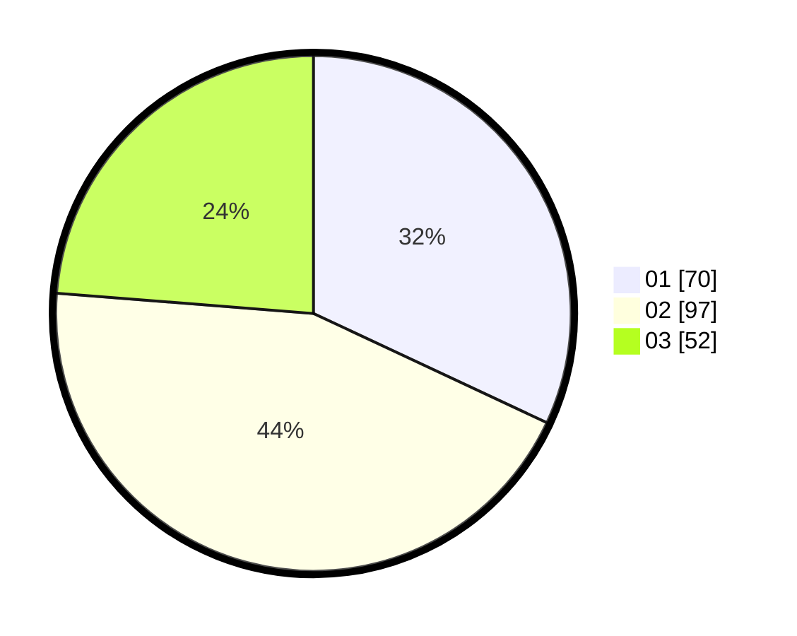

# Hasil

Hasil perolehan suara paslon dapat dilihat pada file paslon-01.txt, paslon-02.txt, dan paslon-03.txt.

Jika tidak ada, artinya data tersebut belum ada pada SIREKAP.

## Perolehan Suara

 * Paslon 01: **70**.
 * Paslon 02: **97**.
 * Paslon 03: **52**.

## Foto C Plano

https://sirekap-obj-formc.kpu.go.id/6b89/pemilu/ppwp/31/71/05/10/01/3171051001002-20240216-014129--a7c7a43b-f301-4ef5-8ee9-073e3e1a1fa4.jpg

https://sirekap-obj-formc.kpu.go.id/6b89/pemilu/ppwp/31/71/05/10/01/3171051001002-20240216-014132--6e09fe30-c68d-45fe-b5ae-ac4a8afbffdf.jpg

https://sirekap-obj-formc.kpu.go.id/6b89/pemilu/ppwp/31/71/05/10/01/3171051001002-20240216-014130--9a44d54b-733f-4b8c-ae18-66bba0d7d8ef.jpg

## DATA PEMILIH TETAP

Jumlah pemilih dalam DPT: **251**.
 * L: **112**.
 * P: **139**.

## DATA PENGGUNA HAK PILIH

Jumlah pengguna hak pilih dalam DPT: **211**.
 * L: **97**.
 * P: **114**.

Jumlah pengguna hak pilih dalam DPTb: **4**.
 * L: **1**.
 * P: **3**.

Jumlah pengguna hak pilih dalam DPK: **7**.
 * L: **3**.
 * P: **4**.

Jumlah pengguna hak pilih: **222**.
 * L: **101**.
 * P: **121**.

## JUMLAH SUARA SAH DAN TIDAK SAH

JUMLAH SELURUH SUARA SAH: **219**.

JUMLAH SUARA TIDAK SAH: **3**.

JUMLAH SELURUH SUARA SAH DAN SUARA TIDAK SAH: **222**.
