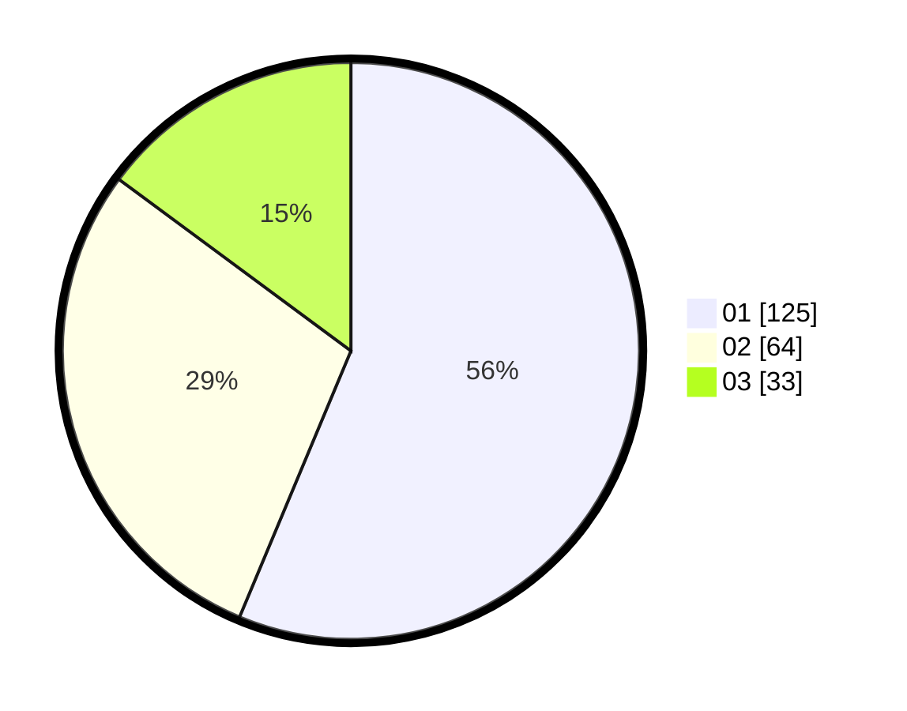

# Hasil

Hasil perolehan suara paslon dapat dilihat pada file paslon-01.txt, paslon-02.txt, dan paslon-03.txt.

Jika tidak ada, artinya data tersebut belum ada pada SIREKAP.

## Perolehan Suara

 * Paslon 01: **125**.
 * Paslon 02: **64**.
 * Paslon 03: **33**.

## Foto C Plano

https://sirekap-obj-formc.kpu.go.id/b66a/pemilu/ppwp/31/71/05/10/01/3171051001005-20240216-115124--8c91cb8d-2d2b-42e8-bda6-bc89a879a77d.jpg

https://sirekap-obj-formc.kpu.go.id/b66a/pemilu/ppwp/31/71/05/10/01/3171051001005-20240216-115125--45dd7e27-e9ba-4101-8959-45b65b638573.jpg

https://sirekap-obj-formc.kpu.go.id/b66a/pemilu/ppwp/31/71/05/10/01/3171051001005-20240216-115124--1cfa2019-a740-430d-9318-0cd9c23feb93.jpg

## DATA PEMILIH TETAP

Jumlah pemilih dalam DPT: **252**.
 * L: **119**.
 * P: **133**.

## DATA PENGGUNA HAK PILIH

Jumlah pengguna hak pilih dalam DPT: **218**.
 * L: **104**.
 * P: **114**.

Jumlah pengguna hak pilih dalam DPTb: **6**.
 * L: **3**.
 * P: **3**.

Jumlah pengguna hak pilih dalam DPK: **1**.
 * L: **0**.
 * P: **1**.

Jumlah pengguna hak pilih: **225**.
 * L: **107**.
 * P: **118**.

## JUMLAH SUARA SAH DAN TIDAK SAH

JUMLAH SELURUH SUARA SAH: **222**.

JUMLAH SUARA TIDAK SAH: **3**.

JUMLAH SELURUH SUARA SAH DAN SUARA TIDAK SAH: **225**.
